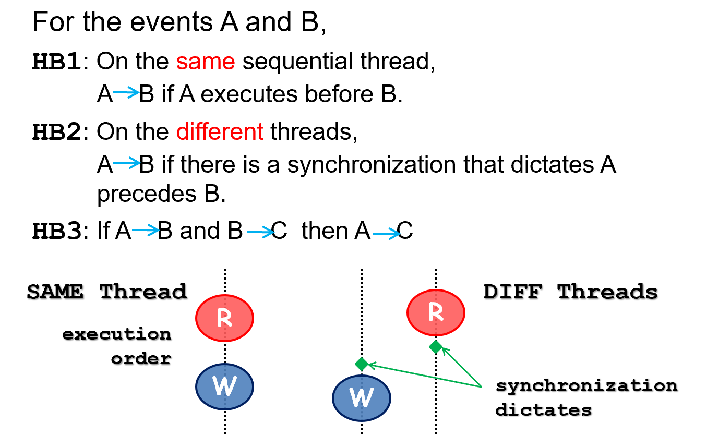
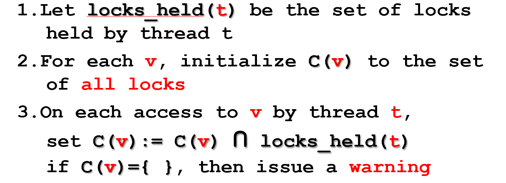
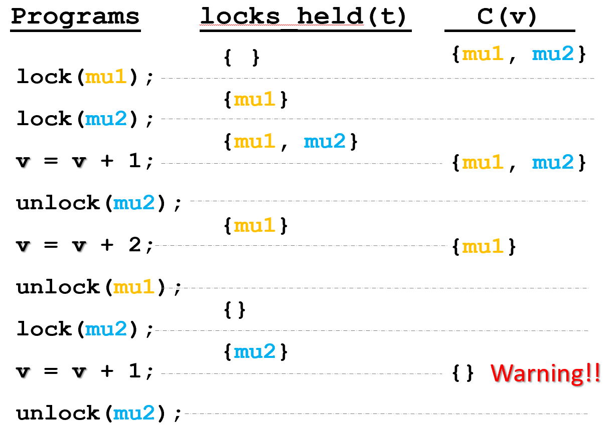
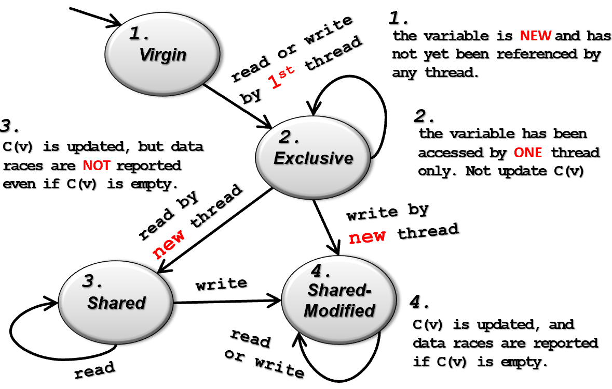
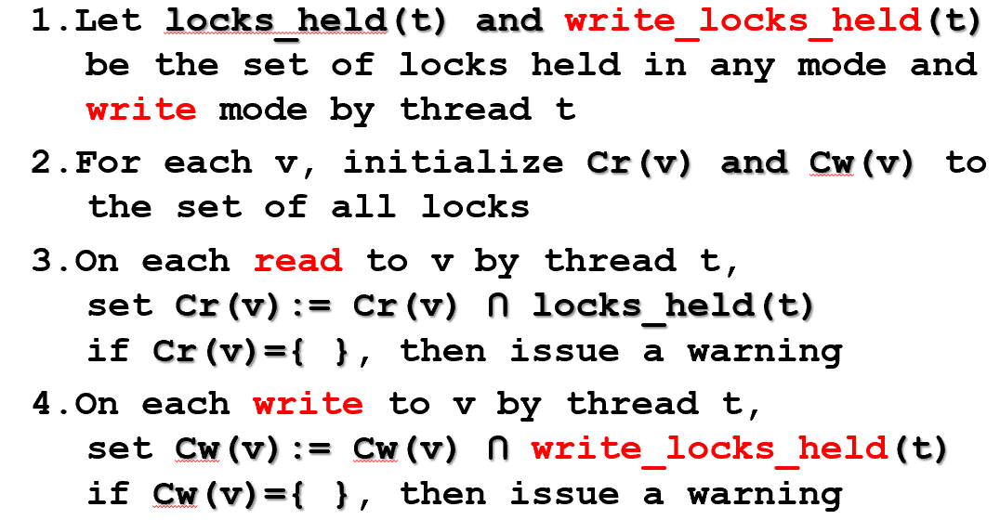
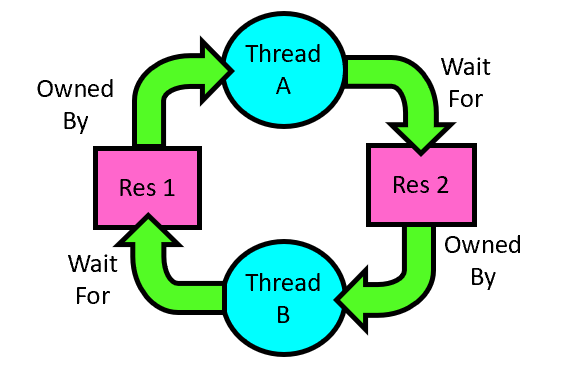

# Bug&Race

## 1. Bug Survey

### 1.1 Concurrent Bug

**Non-Deadlock Bug Pattern**：

- 主要原因：
  - **Atomicity violation**：违背了原子性
  - **Order violation**：并发导致该有的顺序被破坏
- 复现bug要考虑的因素：
  - 多少thread？
    - 2（96%），大部分bug都发生在thread pair之间
  - 多少variable？
    - 1（66%）
    - 多变量（34%），多变量的的并发错误需要被重视
  - 多少次access？
    - <4（97%），测试着力于小数目的访问即可
- 如何修复bug：
  - Adding/changing locks  20 (27%)
  - Condition check  19 (26%)
  - Data-structure change  19 (26%)
  - Code switch  10 (13%)
  - Other    6 (8%)

**Deadlock Bug Pattern**：

- 如何修复bug：
  - Give up resource acquisition  (61%)
    - 可能会引起non-deadlock bug
  - Change resource acquisition order   (23%)
  - Split the resource to smaller ones  (3%）
  - Others   (13%)

### 1.2 Bug in Exception Handler

92%的严重错误是不正确的错误处理导致的：

- 35%是小错误
  - 25%把error ignore了
  - 8% over-catch导致Abort
  - 2% ‘TODO’
- 23%跟特定的系统有关
- 34%复杂错误

### 1.3 OS Bug

- 常见错误：
  - NULL指针
  - copy-paste 错误
- 通用规则：
  - 不在屏蔽中断/持有spin lock的时候调用会block住的函数
  - 检查会产生NULL的结果
  - 不在栈上分配大的变量
  - 不重用已经分配过的memory
  - 如果要在kernel mode使用user指针，就要提前检查
  - 释放持有的lock

## 2. Data Race

### 2.1 Data Race概念

- 出现场景：多个thread想要同时进行操作，但是这些操作必须保持**proper order**，否则就会产生race

- 核心原因：不同thread的运行依赖**same shared state**
- 条件：
  - two concurrent threads access a **shared** variable
  - at least one access is a **write**
  - the threads use no explicit mechanism to prevent the accesses from being **simultaneous**
- 解决办法：mutually-exclusive
  - lock & unlock
  - cli & sti

### 2.2 检测Data Race

#### 2.2.1 Happend-Before Based

**原则**：不满足**HB Relation**，则会产生Data Race

- Pros：一定能检测到

- Cons：
  - 很难高效实现
    - 每个thread，共享的memory位置，并发的访问
  - 依赖scheduler的interleaving调度顺序

#### 2.2.2 Lockset Based

##### 2.2.2.1 基础

**算法**：

**例子：**

##### 2.2.2.2 问题

1. Initialization

   – 共享变量第一次初始化时基本都没锁

2. Read-only Shared Variable

   – 有些变量是只读的

3. Read-Write Lock

   – 有时候被读锁保护，有时候被写锁保护，但在算法算两个不同的锁，交一下就warning

   

- **解决问题1和2**：延迟refinement到**初始化完成**之后
  - 很难知道什么时候完成初始化
  - 消极方法：认为是第一次**被第二个thread访问**时
  - 

- **解决问题3**：除了lock_held set，加入**write_locks_held** set

  

**Lockset based** :

- **pros：**
  - 检测data race更高效
  - 能预测没有表现出来的data race
- **cons：**
  - 会出现误判（false positive）
  - 把synchronization的方法限制在lock这一种上

### 2.3 Dead lock

- 定义：出现对资源的**circular waiting**

- 出现死锁的4个必备因素：

  - mutual exclusion：一个时刻只有一个thread可以使用这个资源
  - hold and wait：拿着一个资源，同时等其他资源
  - no preemption：不可以抢占资源
  - circular wait：等待关系形成了一个环

  

- 避免死锁：
  - Resource ordering：拿锁必须按照一定顺序
    - 保持一个全局的order很难
    - 会导致必须提前拿锁，影响并发性能
  - 检查依赖环
  - 出现死锁就abort掉死锁的thread
    - 选择策略（kill优先级低的/kill资源占用多的）

- Livelock：process的状态频繁改变，导致没有任何进展
- DImumunix：是一个用于开发死锁免疫的工具，当死锁的症状第一次出现的时候，Dimmunix自动捕获它的signature，然后避免输入相同的pattern

