# Exception,Interrupts,System calls

- Exception
  - refers to an illegal program action
- Interrupt
  - refers to a signal generated by a hardware device
- System call
  - a user program can ask for an operating system service

## 1. Exception

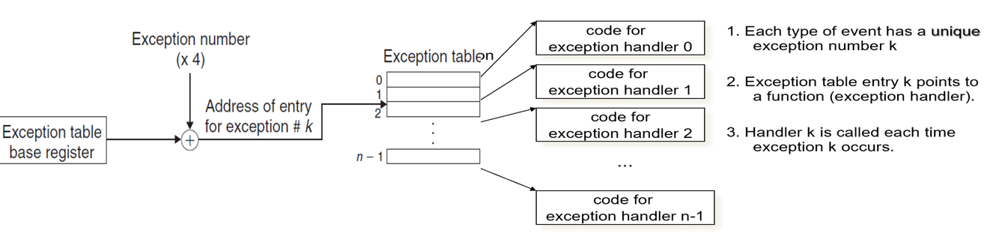

- **IDT: interrupt descriptor table**
  - exception table
  - Has 256 entries
  - Each giving the %cs and %eip to be used when handling the corresponding interrupt
  - System call: `int n`
    - int → interrupt
    - n → IDT index

- **Exception Handler**
  - push **ret addr**到栈上：
    - ret addr可能是当前指令，也可能是下一条指令
  - push其他标识了当前**state**的寄存器到栈上
    - 处理完成后用来resume当前状态
  - 以上内容都是push到**kernel statck**上
  - Exception Handler的代码运行在**kernel mode**
  - `iret`：从interrupt handler返回kernel
    - Restore the process's context
    - Switch from kernel mode to user mode
    - Continue the execution of user's process

  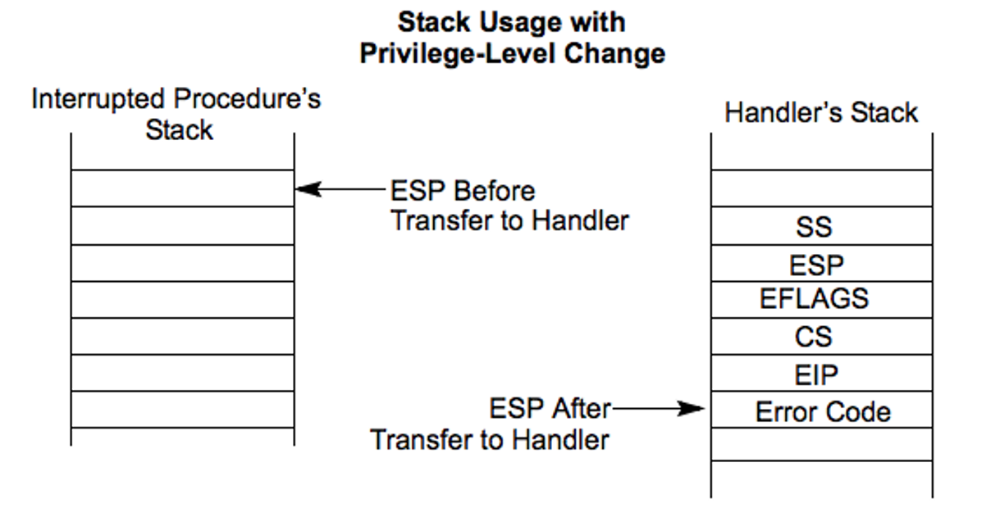

- 会引起user mode→kernel mode的事件：
  - 硬件中断
    - 外部device引发
    - 可以mask掉
  - 软件中断
    - 执行Interrupt instruction（eg. int 0x80)引发
    - 不可以mask掉
  - 程序错误（eg. 除零错误）

------

## 2. Interrupt

- **Interrupts** (异步，由device产生)
  - Maskable: device-generated, associated with IRQs (interrupt request lines); may be temporarily disabled (still pending)
  - Nonmaskable: some critical hardware failures

- **Exceptions** (synchronous, from software)
  - Processor-detected，分为3类：
    - **Faults** – correctable (restartable); e.g. page fault
    - **Traps** – no reexecution needed; e.g. breakpoint
    - **Aborts** – severe error; process usually terminated (by signal)
  - Programmed exceptions (**software interrupts**)
    - int (system call), int3 (breakpoint)
    - into (overflow), bounds (address check)

### 2.1 Terms

- Vector, Interrupt vector, Trap number
- **IRQ**: Interrupt Request
  - softIRQ是bottom half的一种实现机制，与IRQ无关
- **IDT**: Interrupt Descriptor Table
  - 256个interrupt ID有的是固定的，有的可以由用户设置
- **ISP**: Interrupt Service Procedure
- **ISR**: Interrupt Service Routine
- **PIC**: Programmable Interrupt Controller
- **NMI**： Non-Maskable Interrupt
- **EOI**: End of Interrupt

### 2.2 Interrupt handle

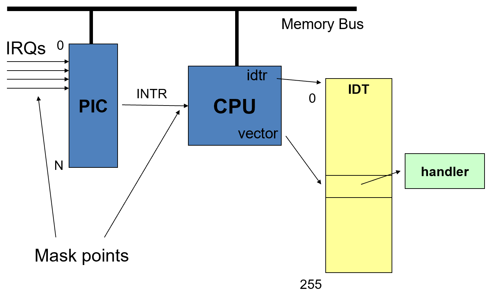

#### 2.2.1 Interrupt Response

- interrupt类似system call，但是是由device生成的，而且任何时候都可能产生

- device产生中断信号→hardware中间处理→通知CPU

  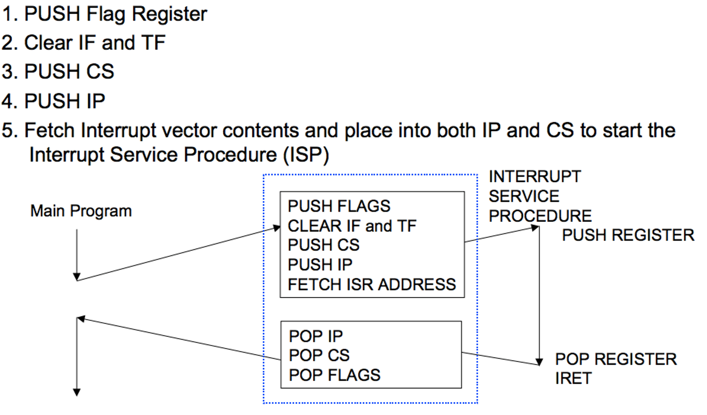

#### 2.2.2 **Interrupt** **routing**

**PIC**（Programmable Interrupt Controller）：

- 每个PIC可以处理8个interrupt，把多个PIC连接在一起就可以处理多个interrupt

- PIC一边与device项链，一边与processor相连

- I/O devices有共享或单独的IRQ，device传来中断请求后，PIC把不同的IRQ映射成i对应的nterrupt vector（trap number），然后传给processor

  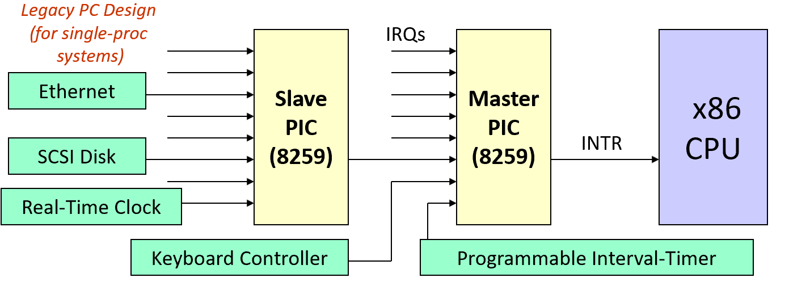

**APIC**（Advanced PIC）：

- 使用系统总线把interrupt路由到CPU

**LAPIC**（Local APIC ）vs **IO-APIC**：

- IO-APIC与I/O设备相连
- LAPIC与CPU相连
- IO-APIC通过总线与LAPIC通信

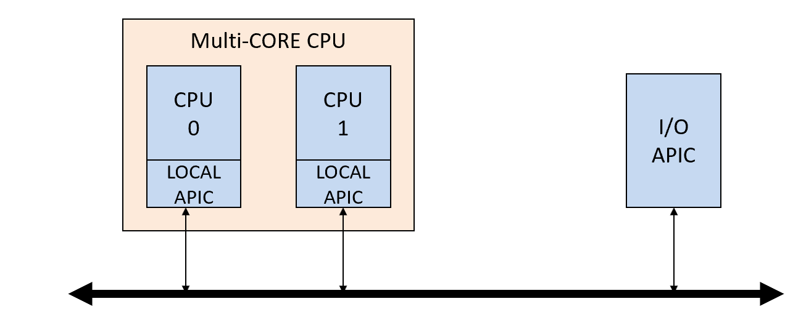

#### 2.2.3 IRQ

- **IRQ assignment is hardware-dependent**
  - Sometimes it's hardwired, sometimes it's set physically, sometimes it's programmable
  - PCI 通常会在boot的时候指定IRQ
- IRQ通常是预设好的
  - 有的可以被user通过hardware/software进行修改
- IDT中的index与IRQ的对应：
  - <32的部分是为NMI和exception保留的
  - 128是syscall
  - Maskable interrupts can be assigned as needed

### 2.2.4 其他

- Interrupt **Priority**
  - 不同的interrupt优先级不同，同时产生的时候先处理优先级高的
  - 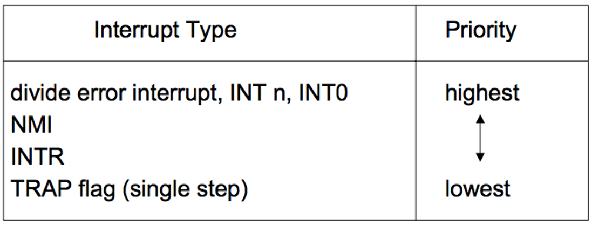

- **End** Of Interrupt：

  - 中断处理结束后要把EOI信号发给PIC
  - IRQ来自master PIC的话，可以只发给master PIC；否则master PIC和slave PIC都要发

- **Nested Interrupts**

  - 处理一个中断的时候可能会产生另一个中断，造成re-entry
  - 在处理中断的时候IRQ-specific的mask是没有开启的
  - interrupt可以被中断，exception可以被中断
  - exception最多嵌套两层，Triple Fault会造成重启

- interrupt **masking**：

  - Global — delays all interrupts
  - Selective — mask individual IRQs selectively

- **Three** **Crucial Data-structures**：

  - The Global Descriptor Table (**GDT**)
    - 记录了segment和segment的访问权限
    - GDTR中记录GDT的地址（系统启动时set）

  - The Interrupt Descriptor Table (**IDT**)
    - 记录了异常的handler的entry
    - IDTR中记录IDT的地址（系统启动时set）

  - The Task-State Segment (**TSS**) 
    -  holds the values for registers **SS** and **ESP** that will get loaded by the CPU upon entering kernel-mode
    - TR中记录了TSS在GDT中的offset

  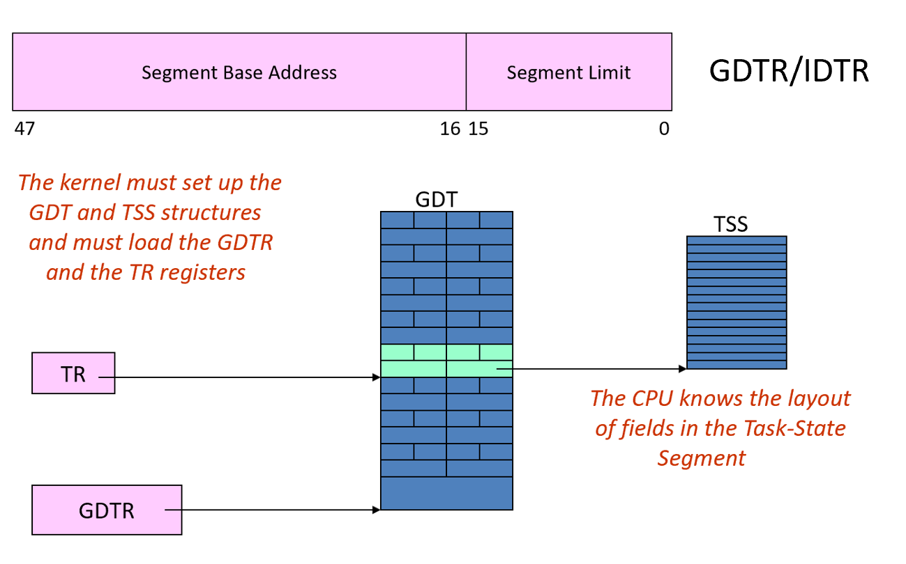

### 2.3 Top/Bottom Half

中断处理的原则：

- 在interrupt handler中做尽量少的工作
- 把没那么重要的工作延迟到之后在做
- **top half & bottom half**
  - Top-half: do minimum work and return (ISR)
  - Bottom-half: deferred processing (softirqs, tasklets, workqueues, kernel threads)

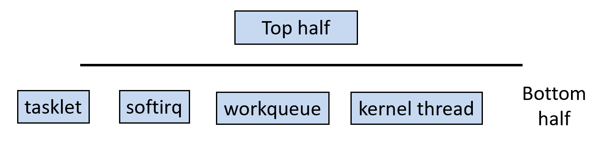

#### 2.3.1 Top Half

**Do it Now !** ：

- interrupt handler
  - Perform **minimal, common** functions: save registers, unmask *other* interrupts.  Eventually, undoes that: estores registers,returns to previous context.
  - 通常是写在汇编里的
- 会暂时把IRQ mask掉
- **Most important**：会调用device driver中的interrupt handler （C程序）
- 会把request给queue起来，然后把延迟处理的flag立起来，交给bottom half处理

**Find the Handler**：

- 通常多个I/O device共享一个IRQ，因此共享一个interrupt vector
- 但是，同一个interrupt vector会关联多个ISR（*interrupt service routines* ），不同的device对应不同的ISR
- top half会call所有相关联的ISR，由device来决定是否这个IRQ是自己发起的

#### 2.3.2 Bottom Half

- 延迟处理
- 没有**Process Context**：
  - 与exception相反，interrupt不是由某个instruction触发的，因此没有与某个process关联
  - 中断发生时正在运行的process与中断没有关系
  - 因此，**Interrupt handlers cannot sleep !**
- Stack：
  - Exceptions: The *kernel stack* of the current process
  - Interrupts: hard IRQ stack (1 per processor)
  - SoftIRQs: soft IRQ stack (1 per processor)

几种bottom half机制：

- **Softirq**：
  - 在kernel编译的时候被静态分配，只有有限的个数
  - 可以在多个CPU上同时运行
    - 要保证re-entrance，还要自行添加lock
  - 运行时不屏蔽硬件中断
  - 可以自行reschedule
- **Tasklets**：
  - 基于softirqs建立
  - 能被动态创建/删除
  - 运行在调度他的那一个CPU上
  - 执行时会被lock住，所以不用再自行添加lock
  - 多个tasklet可以在多个CPU上并行
  - 优先级高于系统中的其他task
- **Work Queues**
  - 由kernel threads运行和调度
  - Softirqs 和 tasklets 运行在interrupt context，但是 work queues 拥有一个 pseudo-process context（**kernel only**），所以可以sleep
  - 被多个device共享
- **Kernel Threads**
  - 运行在kernel mode，没有user context

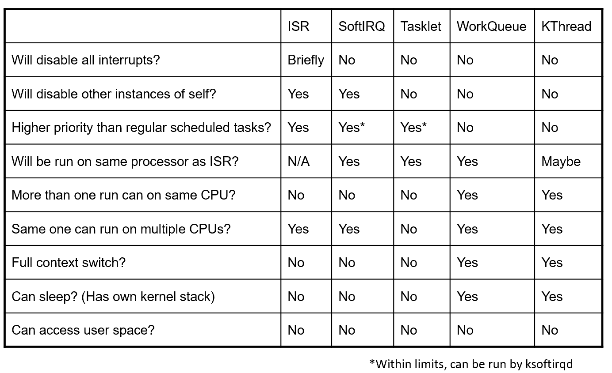

------

## 3. System Call

#### 3.1 调用

- 调用方式：

  - coder view：
    - lib call（eg. `open()`） / `int 0x80`
  - machine view:
    - `int 0x80 `/ `SYSENTER `/ `SYSCALL`

- 返回值：-errno / 0

- 参数：

  - 第一个参数总是syscall number（eax）
  - 允许额外6个参数（ebx, ecx, edx, esi, edi, ebp）
  - 更多的参数只能定义在一个struct里面，然后把指针当第六个参数传递，但是这样可能会有NULL指针和安全问题

- 新的指令：**SYSENTER/SYSEXIT** **&** **SYSCALL/SYSRET**

  - `int 0x80` latency比较高，新指令可以快25%

  - 更快的原因：

    - Assume OS implements a flat-memory model
    - Simplifies calls to and returns from the OS
    - Eliminating unneeded checks
    - Loading pre-determined values into the CS and SS segment registers
    - 下面标红的部分是被优化掉的

    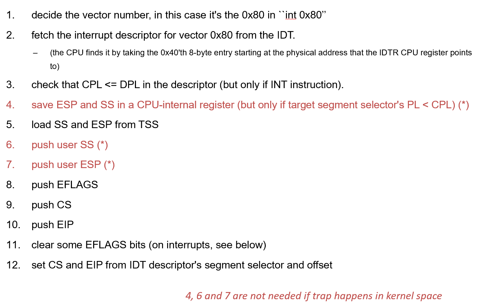

### 3.2 优化

syscall的latency很高：

- state saving/restoring
  - 权限检查
  - cache pollution
- If **no mode switching**, then no state saving/restoring

#### 3.2.1 vDSO

**Virtual Dynamic Shared Object：**

- method：
  - 函数由kernel定义，在编译过程中作为kernel代码的一部分
  - 运行的时候是在**user space运行**，代码被通过**只读**的方式映射到用户共享的page中，称为VDSO，函数内部的变量只能在kernel mode改变

#### 3.2.2 Flex-SC

Flexible System Call Scheduling with Exception-Less System Calls

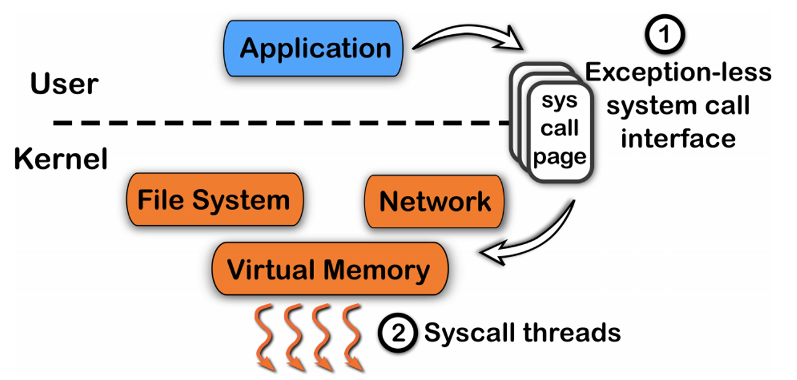

**Flexible System Call：**

- method：
  - user和kernel共享**system call page** 
  - User threads把system call请求**push**到system call page
  - kernel threads**轮循**处理 system call page中的请求
- 在多核时减少了trapping

**Exception-Less System Calls：**

- 通过把syscall的发起和处理进行解耦，从而提升性能
- user检查request的status，没有完成时可以先做其他事情，不用block着等

