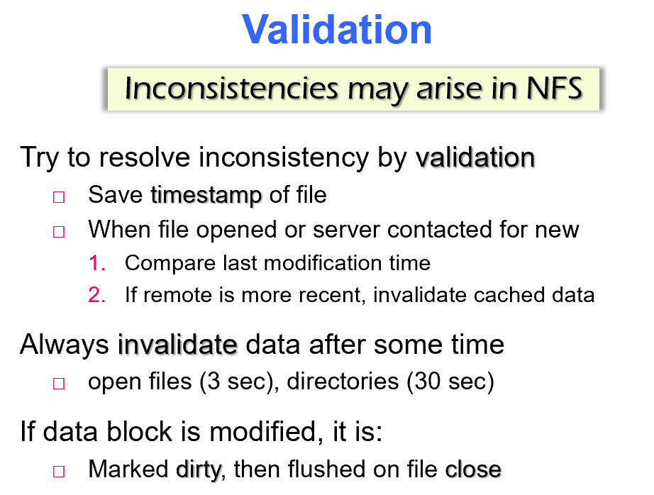

# File systems

## 1. XV6~Ext4

### 1.1 VFS


**Virtual File System Interface**:

- OS中会挂载不止一种FS
- VFS提供了一个统一的调用接口，process不需要知道具体使用的是哪种FS
- 把request发送给下层的特定FS驱动

### 1.2 XV6


- 实现了最小的Unix FS接口：superblock，inode，Dentry，bitmap ，etc
- 缺陷：
  - 不关心磁盘中的分布
  - write-through（简单的保持了一致性，但是很慢）

### 1.3 Ext 

- 使用inode
- 优点：
  - 适用于小文件
  - metadata的局部性很好
  - space managemant很简单
- 缺点：
  - inode和data block不在一起，需要很多seek
  - 同一文件的block不连续，可能导致碎片

### 1.3 Ext2

- FFS：

  - 观察到process倾向于访问同一目录下的文件（空间局部性）
  - 把一个目录下的文件放在一个cylinder group内

  

- Ext2

  - 受FFS启发，引入**Block Group**
    - 每个block group有自己的数据结构
    - 倾向把一个目录下的文件分在一个bg内
  - 优点：性能好（空间局部性）
  - 缺点：
    - 大文件会跨bg
    - FS变复杂了，出错崩溃的几率上升

### 1.4 Ext4


- 使用**Extent**作为inode中的数据分配单元

  - indirect block对于大文件来说会造成大量random seek
  - extent描述了一组连续的block
    - 适用于大文件/连续的文件
    - 减少了碎片

  


- 使用**B-tree**来表示directory
  - 之前一直用entry(<inode, filename> list)
    - 无序，中间还会出现空enrty
    - 查找复杂度O(n)

## 2. Crash Consistency

三种方法：

- **Synchronous meta-data update +** **fsck**
- **Soft update**
- **Logging**

### 2.1 Synchronous meta-data update + fsck

- FS要保证metadata是可以恢复的

  - 需要合理安排写数据和写metadata的顺序，里避免dangling reference

    ```c
    1. initialize a new inode before creating dirent 
    2. delete dirent before marking inode free 
    3. mark block in-use before adding it to inode addrs[] 
    4. remove block from addrs[] before marking free  
    5. zero block before marking free 
    ```

- fsck

  - 流程：

  ```c
  1. 检查superblock
  2. 检查free blocks，保证bitmap里面记录的使用情况是对的
  3. 检查inode state，把异常inode删掉
  4. 检查inode link，确保link count是对的，count=0的删掉
  5. 检查duplicates（两个inode指向同一个block），删掉一个bad inode或者copy一份
  6. 检查bad block，一处指针
  7. 检查directory（.，..,finename，etc.）
  ```

  - 缺点：非常非常慢

- Sync I/O vs. Async I/O

  - 异步I/O很难保证一致性
  - 同步I/O很慢

- Write-back cache

  - buffer写操作，可以提高性能
  - 但是可能影响一致性，使用fsck也无法恢复，因为已经不能保证操作的原子性了

### 2.2 Logging (Journaling)

#### 2.2.1 Xv6 simple logging

- 机制：
  - begin_trans：一次只允许一个transaction运行
  - log_write：把有改动的block写到log
  - commit_trans：
    - 写“done”和“sector #s”进log
    - 把log中的写进disk中
    - 清除log中的“done”
  - recovery：把有“done”的写进disk
- 缺陷：
  - 一次只有一个transaction
  - 写两次(log & disk)
  - 有一点点改动都要重写整个block
  - write through

#### 2.2.2 Ext3

- **JFS:** **Journaling** **FS**：

  - 不care data在disk上的分布

  - Transaction更新是一个原子操作

  - 以block为单位，commit标志着block被写入journal，但是不代表写入disk

  - checkpoint：把log中的commit写入disk

    ```c
    1. 关闭transaction，FS的后续操作讲并入另一个transaction
    2. pin buffer，把journal写入disk
    3.写完成后，更新journal的header block
    4. unpin buffer
    5. 释放journal的空间
    ```

- **Ext3**：

  - 调用JFS来处理log

  - 架构：

    - memory中：
      - write-back cache
      - per-transaction info
    - disk中：
      - FS & circular log

  - 高性能feature：

    - 批处理（每个transaction包含多个syscall），几秒commit一次
    - 并发transaction和syscall

  - Syscall

    - start：要开始写了，现在不可以commit
    - get：要改cached block，现在不可以写block到disk
    - stop：可以commit了（不代表引发了commit）
    - 会提前声明需要的log space，log不够时会block住

  - **Committing a transaction to disk**

    ```c
      1. block new syscalls
      2. wait for in-progress syscalls to stop()
      3. open a new transaction, unblock new syscalls
      4. write descriptor to log on disk w/ list of block #s
      5. write each block from cache to log on disk
      6. wait for all log writes to finish
      7. write the commit record
      8. wait for the commit write to finish
      9. now cached blocks allowed to go to homes on disk (but not forced)
    ```

  - 一致性保障：

    - 由inode lock来保证没有data race
    - commit order是始终一致的
    - transaction被free，cached block写入disk之后，才可以重用log space

  - mode：

    - **Journaled Mode**：两次写（journal&disk）
    - **Ordered Mode** ：
      - 不写file content进log，直接写disk
      - log中写metadata，在commit之前保证content已经都写道disk了
      - 在commit之前不可以重用freed block

  - 比起 Xv6的性能改进：

    - 并发transaction
    - 批处理commit
    - 不再是整个block都更新（indirectly）
    - write_back

  - 缺陷：

    - 没有checksum（Ext4）
    - 对于fsync不太够

## 3. FAT FS

File Allocation Table (FAT)


## 4. NTFS


## 5.MBR & Mount


## 6. Flash FS

**FlexFS**：

- Exploits the flexible cell programming to achieve the **SLC（Single Level Cell） performance** and **MLC（Multi Level Cell）  capacity** while ensuring a reasonable **lifetime**


- Performance Manager：

  

  

- Flash Manager：

  

- Wear Manager：

  

## 7. LFS

**Log-based File Systems**

- Key idea: buffer all writes (including meta-data) in memory
  - Write these long segments to disk sequentially
  - Treat the disk as a circular buffer, i.e. don’t overwrite

- Advantages:
  - All writes are large and sequential
- Big question:
  - How do you manage meta-data and maintain structure in this kind of design?


- LFS适用于SSD

## 8.GFS

Google FS


## 9. NFS

