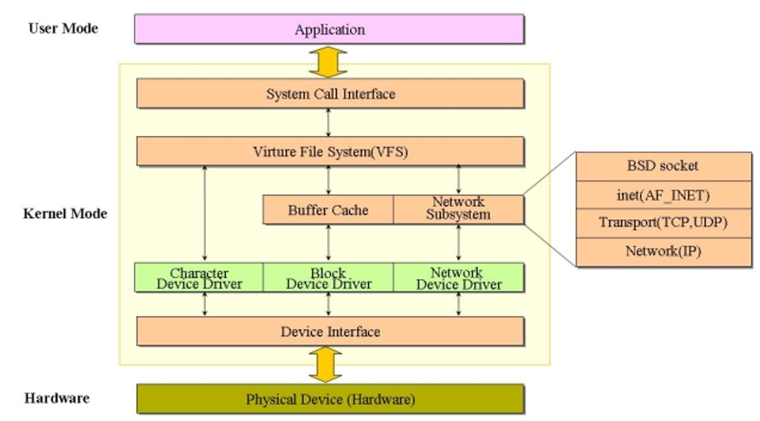

# OS Introduction

### 1. Why OS is important?

Operating system is a maturing field→Hard to get people to switch operating systems

Many things are OS issues：

- High-performance
- Resource consumption
- Battery life, radio spectrum
- Security needs a solid foundation
- New “smart” devices need new OS

### 2. 8 important problems

- Scale Up 
  - 纵向扩展，更快运行更多software
  - 实现多核更高性能（受lock、共享数据、共享硬件限制）
  - 对user-app提供更好抽象；消除不可扩展同步；最小化共享资源；
- Scale Out
  - 横向扩展，分布式系统
  - 困难：系统设计；一致性；容错；不同部署场景；安全性；实现；
- Security & Privacy
- Energy Efficiency
- Mobility 
  - 移动端OS：高能源利用率；有限资源；安全问题（更多data存在OS）
- Write Correct (Parallel) Code
- Non-Volatile Storage
- Virtualization
  - 资源复用；容错；轻便；易于管理

## 补：3. I/O

### 3.1 I/O subsystem

- 为什么需要？
  - device是不可靠的（传输错误/设备fail）
  - device的行为是难以预料的，通常还很慢
- 目标：
  - 为不同的设备提供一个统一的接口
    - device driver（设备驱动）来实现standard interface
  - 为I/O硬件提供一个抽象层
    - 来管理并与硬件交互
    - 隐藏硬件和操作细节

### 3.2 Device Interface

常见的有三种：

- Character devices
  - 键盘/鼠标，serial port，一些USB设备
  - 序列的访问，一次一个字符
  - get() / put()
  - xv6中的指令：in/out
- Block devices：
  - disk drive, tape drive, DVD-ROM
  - 访问以block为单位的数据
  - Raw I/O，FS，MMIO
- Network devices
  - Ethernet, wireless, bluetooth
  - 有不同于另外两种的接口，提供特殊的网络接口来支持不同的网络协议
    - send/receive

### 3.3 Synchronous and Asynchronous I/O

- Blocking I/O: “Wait”
  - 请求数据的时候block，直到data ready
  - 写数据的时候block，直到device ready
- Non-blocking I/O: “Don’t Wait”
  - 一定字节的数据传输成功就直接返回
  - 有可能什么都没读到，也没写出去
- Asynchronous I/O: “Tell Me Later”
  - 把user buffer的指针交给kernel，kernel完成操作（读取/接收）之后通知user

### 3.5 I/O Device Notifying the OS

- 轮循Polling：
  - 方法：
    - device把I/O的状态信息写到每个device的状态寄存器里
    - OS周期性检查这些寄存器
  - 优点：overhead小
  - 缺点：当I/O少或者没有按照意料中进行时，就很浪费cycle
- 中断Interrupt driven：
  - 优点：能够处理unpredictable events 
  - 缺点：中断的overhead很高
- hybrid：
  - eg. 高带宽网络设备：
    - 收到一个包后发中断
    - 后续的包采用轮循

### 3.6 Device Driver

设备驱动：

- 含义：kernel中的device特定的代码，直接与device硬件进行交互
  - 实现一个standard internal interface
  - 不同的kernel I/O系统都可以很容易的与驱动进行交互
  - 特殊的device配置是由ioctl()来支持的
- 通常分为Top half 和 Bottom Half