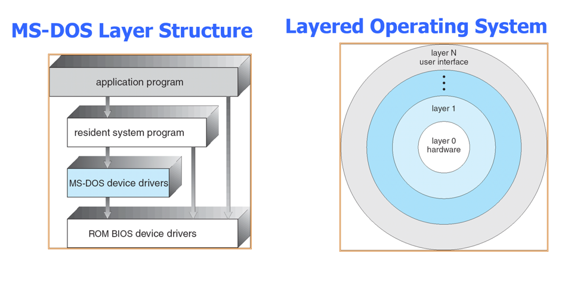
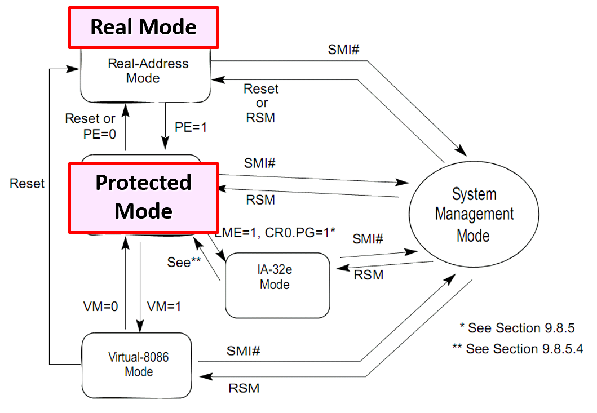

# OS structure

## 1. Kernels

- Monolithic
  - Linux，BSD
- Microkernel
  - Mach，L4
- hybrid
  - Windows NT
- Exokernel

### 1.1 MS-DOS

DOS没有模块的划分，接口和实现没有很好的分离。

DOS以后开始有一些Layered Approach，将OS分为若干level来实现

### 1.2. Monolithic（UNIX）

- UNIX OS = System programs + kernel

  

### 1.3. Microkernel

- Communication takes place between user modules using message passing

- **Pros**：容易扩展；容易迁移；更可靠（kernel mode的代码变少）；更安全；

- **Cons**：communication带来的overhead导致速度很慢

  

#### 1.3.1. Mach

**Mach** kernel do：

1. Task and thread management
   - CPU调度策略可由application实现
2. Inter process communication (IPC)
   - 通过port实现不同thread之间的通信
3. Memory object management：virtual memory
4. System call redirection:
   - trap → control transfer to user
   - enable applications to modify/extend the behavior and functionality of system calls
5. Device support/User multiprocessing/Multicomputer support

#### 1.3.2. L4

Synchronous IPC → Asynchronous IPC：实现了速度的极大提升

### 1.4. Exokernel

核心观点：只要内核还提供对系统资源的抽象，就不能实现性能的最大优化 -- 内核应该支持一个最小的、高度优化的原语集，而不是提供对系统资源的抽象。

- let each program decide what to do with these resources.
- The program can link to an operating system library (libOS) that implements OS abstractions

kernel job：

- Tracking ownership of resources ← secure binding
- Ensuring resource protection ← visible revocation
- Revoking resource access ← abort protocol

缺点：user application自己定制OS的话，customer-support就变得很难，因为不知道定制的OS会是什么样子，就不知道怎么support

### 1.5 Comparison

------

## 2. System Architecture

### 2.1 Modes

#### 2.1.1.

CPU运行的几种mode：

- **Real Mode**（实模式）：
  - 早期的8086 CPU的工作模式
  - 没有虚拟地址
  - （物理地址 = 逻辑地址） = 段基地址 + 段内偏移
  - 16-bit 偏移（每个段64K） *  4-bit 段 = 1MB 寻址空间 
- **Protect Mode**（保护模式）：
  - 常用的模式
  - 最大寻址/最大分段 = 4G
  - 提供内存保护，分页，虚拟内存等
- **Virtual-8086 Mode**：在保护模式下运行的虚拟实模式环境，寻址方式与实模式相同。
- **IA-32e Mode**：64位操作系统运行的模式，具有兼容模式和64位模式两种子模式。兼容模式可以运行在32位兼容环境，但不能运行虚拟8086程序；64位模式则完全处理64位指令
- **System Management Mode**：独立于OS的地址空间，用来执行电源管理或系统安全方面的指令。

#### 2.1.2. EFLAGS register

- IF：中断开关

#### 2.1.3. Control Registers

- **CR0**：
  - PE：控制保护模式和实模式的切换
  - PG：控制开启页表
- **CR2**：记录发生page fault的地址
- **CR3**：记录page directory的基地址，是VM到PM翻译的起点
- **CR4**：
  - PSE：控制开启superpage mode
  - PAE：控制开始physical memory extension

#### 2.1.4. Memory-Management Registers

- **GDTR** (Global Descriptor Table Register)

  - Base Address, Limit …

    

- **IDTR** (Interrupt Descriptor Table Register)

  - Handler Address, Ring Level …

- **TR** (Task Register)

  - TSS 

### 2.2 Memory Model

#### 2.2.1.

- **8086**：

  - Real Mode：**16**-bit 偏移（每个段64K） *  **4**-bit 段 = 1MB 寻址空间 

  - The extra 4 bits come from *segment registers*

    •**CS**: code segment, for EIP

    •**SS**: stack segment, for SP and BP

    •**DS**: data segment for load/store via other registers

    •**ES**: another data segment, destination for string ops

    •*e.g.* `CS`=**f**000， `IP`=**fff0**  →  `ADDR`: **ffff0**

- **80386**：

  - Protected Mode
  - 32-bit → 64-bit

#### 2.2.2.Physical Address Space Layout

- A20 line：曾经只能提供20-bit（1MB）地址，随着科技发展，已经远不止这个数了，但是为了兼容，所以要特别开启一下，才能使用1MB以上的地址空间

#### 2.2.3.Memory-mapped I/O

- Use normal addresses
  - No need for special instructions
  - No 1024 limit
  - System controller routes to device
- Works like “magic” Memory
  - Addressed and accessed like memory
  - But does not behave like memory
  - Reads and writes have “side effects”
  - Read result can change due to external events
    - the “*volatile*” keyword

### 2.3 Booting

- 等待I/O可用

- 将BIOS上的boot loader代码加载到**0x7C00**地址

- 从实模式转换为保护模式

  

- 初始化段寄存器

- 初始化帧指针和栈指针

- 跳转到`bootmain`

  

- 读取disk上第一个page中的ELF文件

- 根据ELF中的记录，load kernel

  

