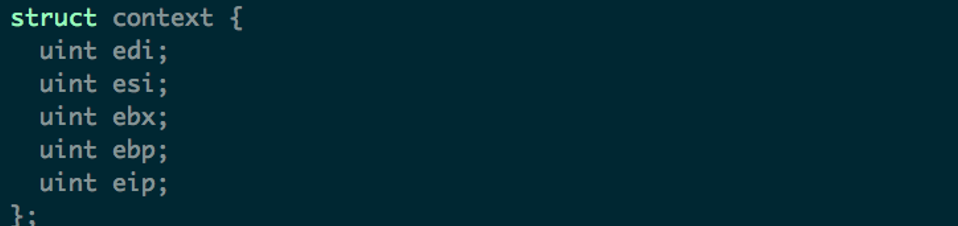
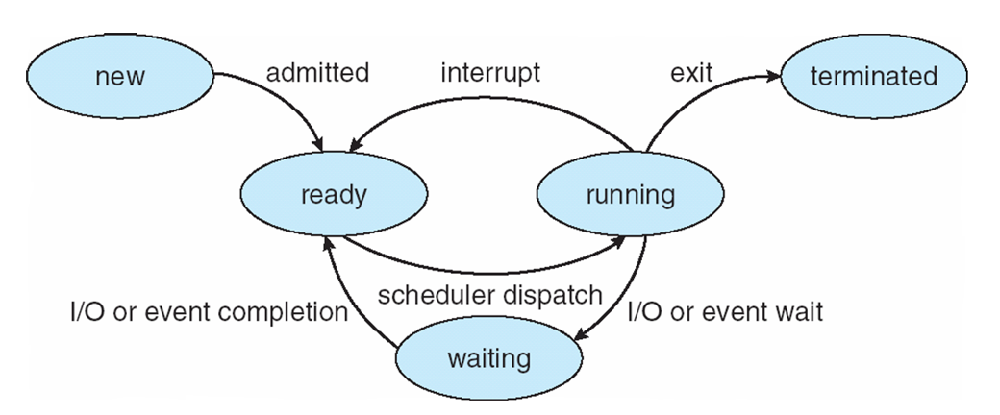
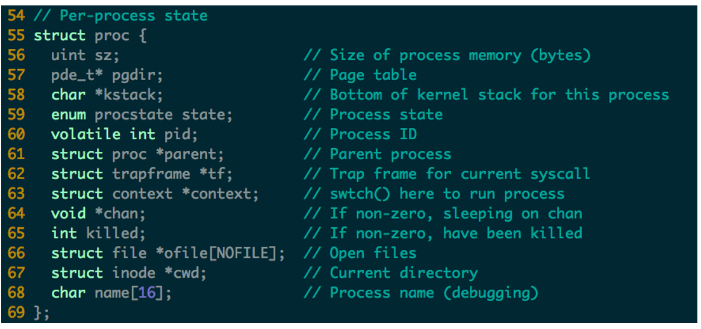
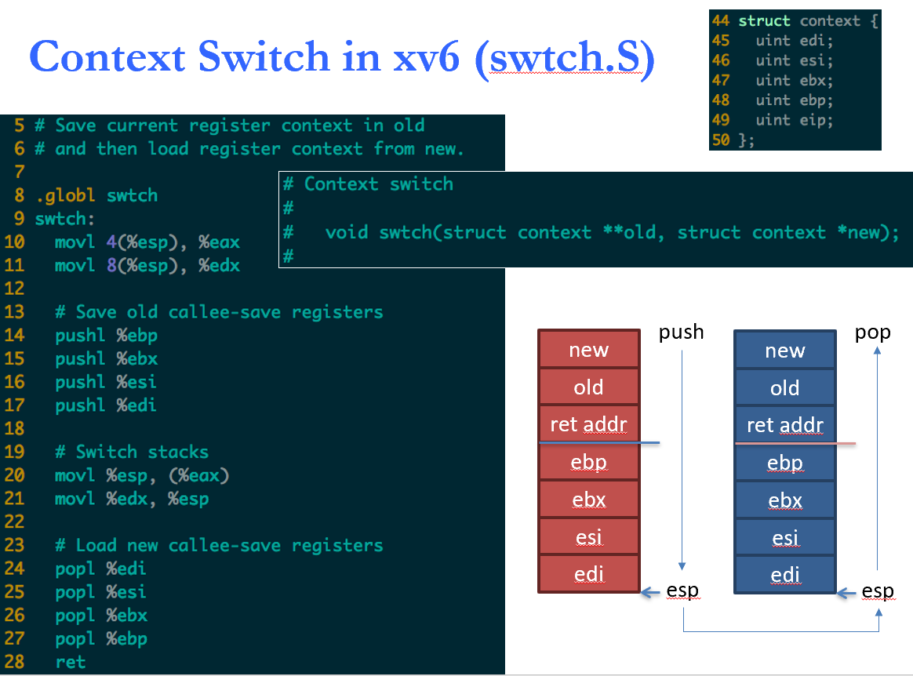
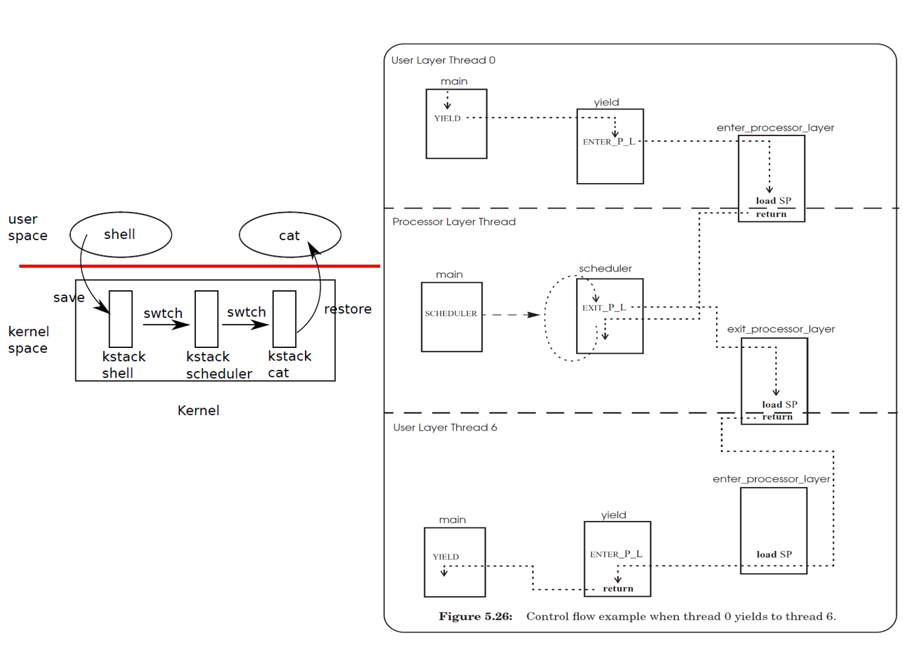
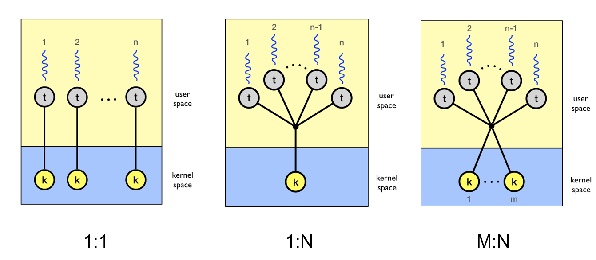
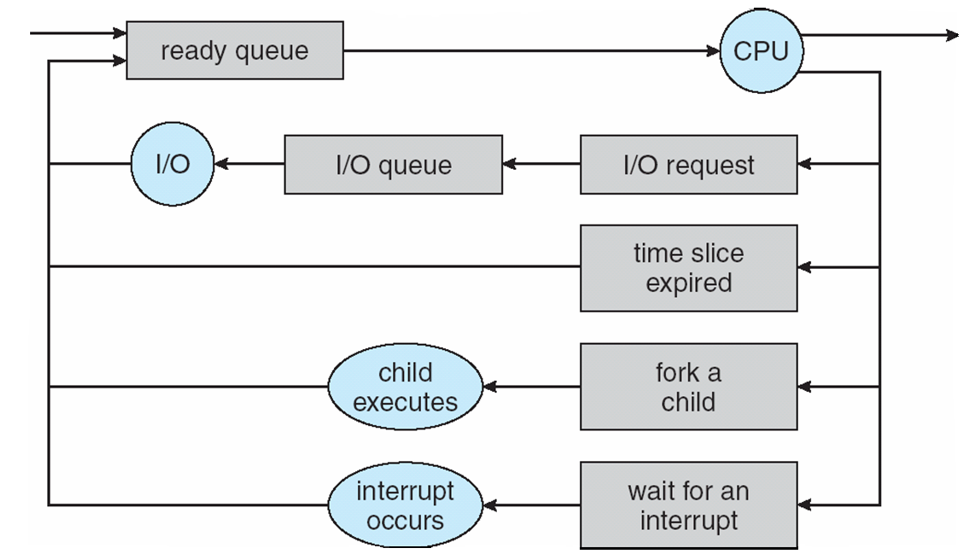
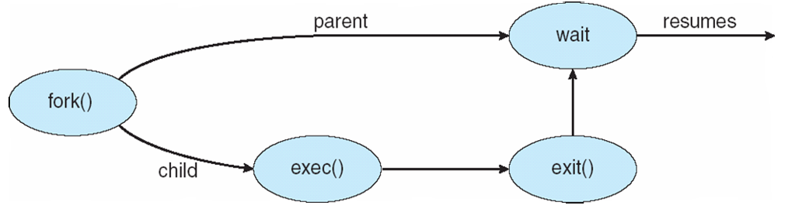
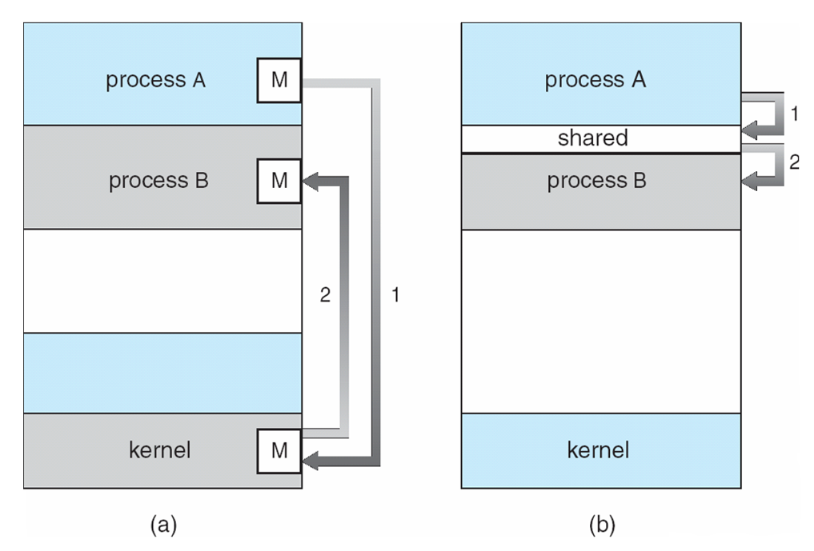
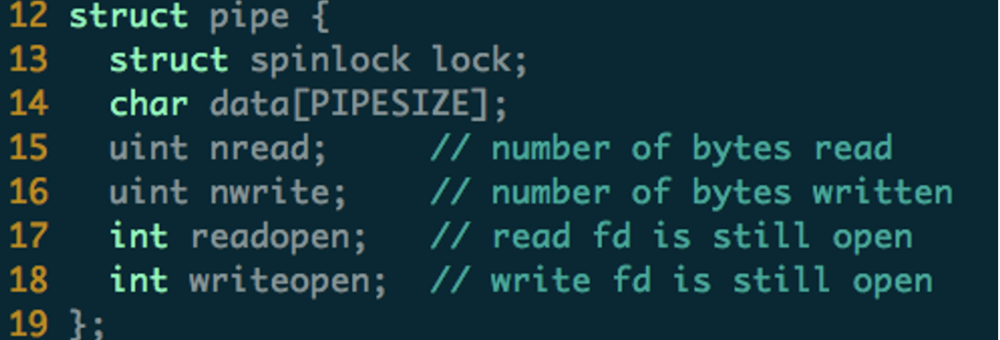

# Process

## 1. Thread & Process

### 1.1 thread

- thread是一个**运行单元**的抽象（调度的最小单元）

- 包含the *minimal state* that is necessary to stop an active and resume it at some point later

  - The state depends on the processor，on x86, it is the processor registers

  

- Address spaces 和 threads 是相互独立的概念：
  - One can switch from one thread to another thread in the same address space
  - or one can switch from one thread to another thread in another address space

### 1.2 process

- process是一个在执行的程序（资源分配单元）

  - $1$ * address space + $1^+$ * thread

  - 包含 program counter, stack, data section

- process的state在它运行过程中不断改变

  - **new**:  The process is being created

  - **running**:  Instructions are being executed

  - **waiting**:  The process is waiting for some event to occur

  - **ready**:  The process is waiting to be assigned to a processor

  - **terminated**:  The process has finished execution

    

- **Process Control Block (PCB)**与对应process相关联，包含process的信息

  - Process state

  - Program counter

  - CPU registers

  - CPU scheduling information

  - Memory-management information

  - Accounting information

  - I/O status information

    

## 2. Context Switch

### 2.1 Context Switch

#### 2.1.1 switch

从一个process切换到另一个process

- save the state of the old process
- load the saved state for the new process Context of a process represented in the PCB

- 更改%esp（换栈）标志着switch
- 调用swtch时把%eip存到了栈上（ret addr），所以后面一系列pushl中没有eip

#### 2.1.2 kernel/user thread

**•Q: What is the difference between context and thread?**

- context是thread的state，thread（thread_info）中还有很多其他的信息

**•Q: What is the difference between a kernel thread and a user thread?**

- kernel mode thread can access any kernel memory and user memory, while the user mode can only access the user memory
- 内核线程只运行在内核态，而普通线程既可以运行在内核态，也可以运行在用户态
- 因为内核线程只运行在内核态，它们只使用线性地址的高地址，普通进程可以使用4GB的线性地址空间

**•Q: Does every user-level thread has a kernel-level thread?**

**•Q: Which one is selected by a scheduler? Context, thread or process?**

- thread是调度的最小单元

**•Q: The number of kernel stack equals to the number of which: context, thread or process?**

- kernel stack数量 = context 数量

**•Q: Can a kernel thread has multiple contexts?**

- multi-thread 会有

**•Q: When all CPU cores are running in user-level, all the kernel stacks are empty?**

- 不是

**•T/F：Context is a concept in kernel, because user cannot switch stack**

- 错

•**Q: To fully utilize a multi-core CPU, which threading model should be used: user-level thread or kernel thread?**

- kernel thread。因为一个kernel thread对应一个core

•**Q: What is the difference between user-level threading and co-routine?**

- user-level threading（靠函数lib） ，co-routine（语言级）

### 2.2 Process Scheduling Queues

- **Job queue** – set of all processes in the system
  - **Ready queue** – set of all processes residing in main memory, ready and waiting to execute
  - **Device queues** – set of processes waiting for an I/O device

- **Scheduler**
  - **Long-term scheduler**  (or job scheduler) – selects which processes should be brought into the ready queue
    - controls the *degree of multiprogramming*
  - **Short-term scheduler**  (or CPU scheduler) – selects which process should be executed next and allocates CPU

## 3. Fork

- parent process调用fork来创建一个child process
  - 使用**process identifier** (**pid**)来区分不同process
  - child：fork返回0，parent：fork返回child pid
- Execution
  - Parent and children execute **concurrently**
  - Parent waits until children terminate
    - 如果Parent要exiting，就要先级联的把child给terminate掉
- Address space
  - Child **duplicate** of parent’s
  - Child has a program loaded into it

## 4. IPC & LRPC

- Cooperating processes need **inter-process** **communication** (**IPC**)
- Two models of IPC
  - Shared memory
  - Message passing
- Unix IPC mechanisms
- LRPC: Lightweight RPC

### 4.1 IPC model

**Message passing** & **Shared memory**

#### 4.1.1 Shared memory

- **Bounded-Buffer** 

  - Producer-Consumer problem

- IPC in xv6：Pipe

  
  - writer：2次 wakeup（buffer full时 & after write） 
  - reader：1次wakeup（after read）

#### 4.1.2 Message passing

- **Communication Link**
  - 通过调用send/receive使用
  - 实现方式：
    - 物理：shared memory, hardware bus
    - 逻辑：logical properties
- **Direct Communication**
  - 指明sender和receiver
  - 一个link只连接一对process
  - 一对process之间只有一个link
  - link通常是双向的
- **Indirect Communication**
  - 不指明sender和receiver，通常从**mailbox**中接收信息
    - mailbox有id
    - 共享一个mailbox的process之间可以通信
  - link在共享一个mailbox的process之间共享
  - 一个link可以连接多个process
  - 一对process可能共享多个link
  - 问题：
    - 有多个process同时receive时谁获得message？
    - 对策：限制link连接的process数；禁止receive并发；指明receiver；

#### 4.1.3 Synchronous IPC & Asynchronous IPC

- **Blocking** is considered **synchronous**
  - **Blocking send** has the sender block until the message is received
  - **Blocking receive** has the receiver block until a message is available

- **Non-blocking** is considered **asynchronous**
  - **Non-blocking** send has the sender send the message and continue
  - **Non-blocking** receive has the receiver receive a valid message or null

- Asynchronous → **Buffering**
  - Zero capacity – 0 messages
     Sender must wait for receiver (synchronous)
  - Bounded capacity – finite length of *n* messages
     Sender must wait if link full
  - Unbounded capacity – infinite length 
     Sender never waits

### 4.2 LRPC

IPC is usually heavyweight：

- 各种形式的IPC通常都需要进行Notification（向process发送信号），Scheduling（在不同process之间进行切换），Data transfer
- Blocking
- Signals 

**Lightweight RPC (LRPC):**

- Simple control transfer: client’s thread executes in server’s domain
- Simple data transfer: shared argument stack, plus registers
- Simple stubs: i.e. highly optimized marshalling
- Design for concurrency: Avoids shared data structures

**LRPC Binding**：connection setup phase

- 为调用接口中的每个procedure在内核中注册过程描述符(PDs)
- 对于每个PD，参数栈(A‐stack)都在两个域中预先分配和映射读/写
- 内核预先分配linkage record，以便从A‐stack返回
- 将A‐stack列表作为绑定对象返回给客户端