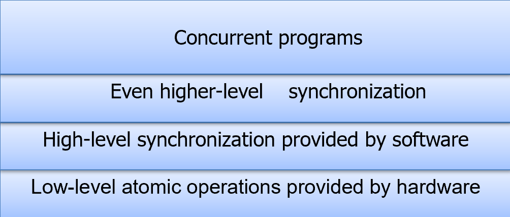
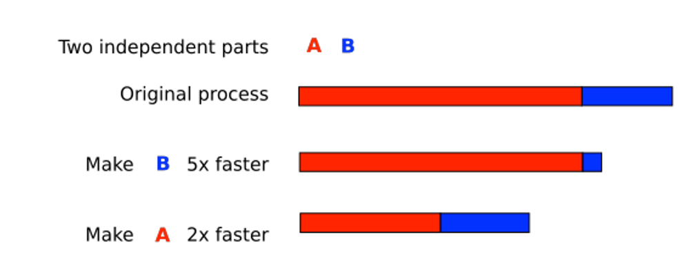
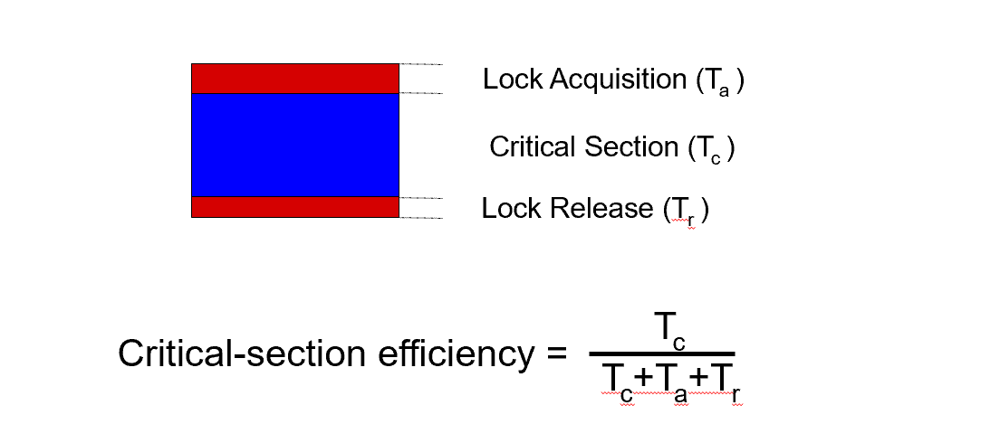
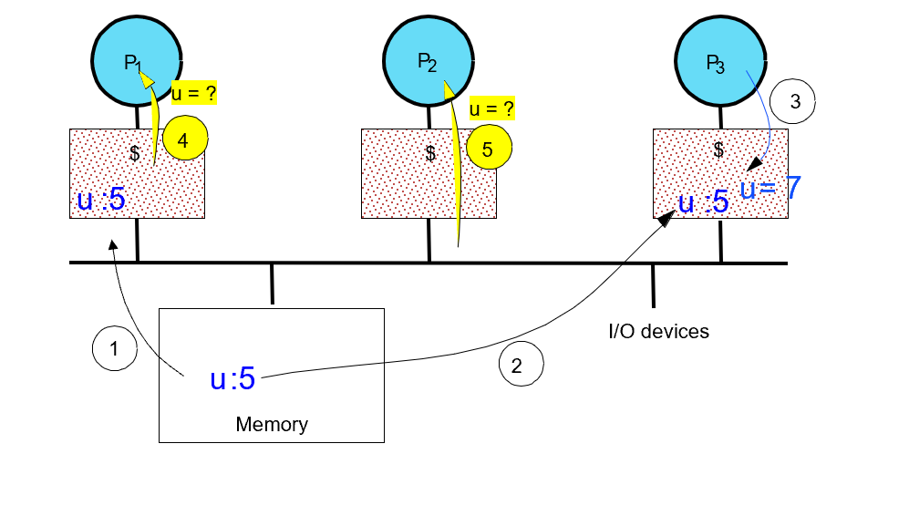
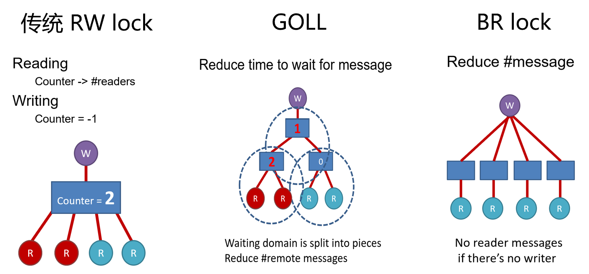
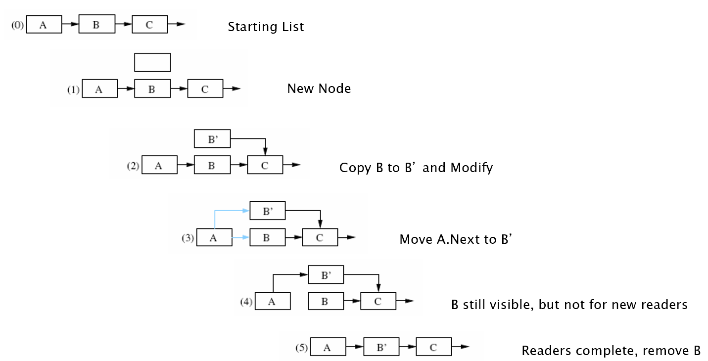
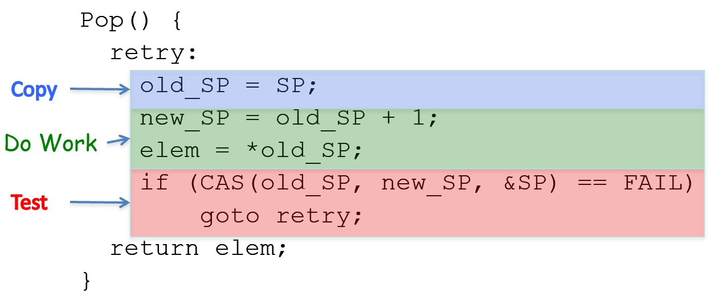

# Synchronization

同步的层级依赖



## 1. Scalability

- 可扩展性：在N个core的情况下，Application可以做在1个core上的N倍的工作

- 限制 - **Amdahl's Law**

- $$
  S_{latency}=\frac{1}{1-p+p/s}
  $$

  - p：并行计算部分所占的比例，s：并行处理节点个数
  - 通过更快的处理器来获得加速是**由慢的系统组件所限制**（有种木桶效应的感觉）
    - eg. 若串行代码栈所有代码的25%，那并行处理的总体性能不可能超过4

  

- **Locking**

  - mutual exclusion

  - 用lock来保护critical section

    

## 2.Non-scalable Locking

- **Non-scalable Locking are dangerous**

  - eg. spin lock
  - 高并发时性能差
  - 即使是很小的critical section也会导致performance collapse

- **cache coherence**：

  - 在多核时，每个核都有自己的cache

  - 当某个CPU修改了memory之后，要保证各个cache与memory的内容一致

    

  - 实现方式：

    - Directory-based cache coherence：产生写操作之后把directory中的Probe message改掉，这样另一个CPU读的时候就知道被修改了，就去前一个CPU的cache里面读最新的数据
    - Snooping

- **Intuition of the collapse**

  - 多核的时候，每个waiter都要去owner那里读取lock的状态，coherence信息是被序列处理的
  - reader很多的时候就需要等很久，性能很差

## 3.Scalable Locking

### 3.1 MCS lock

**MCS lock**

- 全局只有一个MVS lock
- is_locked 标志是否在等待，next是下一个要锁的
- waiter都**spin在自己的is_locked**处
  - 不用所有人都去访问一个全局变量，这样避免了高并发影响性能

```
mcs_node{
  mcs_node next;
  int is_locked;
}
mcs_lock{
  mcs_node queue;
}
```

**lock**：

- 使用fetch_and_store把mcs_lock的queue指向self node，加入排队
- 检查previous node
  - 为NULL，不需要等
  - 不为NULL，把previous node的next设为self node

```c
function lock(mcs_lock lock, mcs_node my_node){
  my_node.next = NULL;
  mcs_node predecessor = 
        fetch_and_store(lock.queue, my_node);
  if(predecessor != NULL){
    my_node.is_locked = true;
    predecessor.next = my_node;
    while(my_node.is_locked){};
  }
}
```

**unlock：**

- 使用compare_and_swap退出排队
- 改掉next.is_locked属性，把锁传递下去

```c
function unlock(mcs_lock lock, mcs_node my_node){
  if(my_node.next == NULL){
    if(compare_and_swap(lock.queue, my_node, NULL){
      return;
    }else{
      while(my_node.next == NULL){};
    }
  }
  my_node.next.is_locked = false;
}
```

### 3.2 Reader-Writer Lock

#### 3.2.1

多线程并发读写的问题：

- 没有进程访问数据的时候才可以write
- 没有进程写数据的时候才可以读

核心：

- 共享的数据：NumReaders, NumWriters
- 顺序约束：
  - readerStart must wait if there are writers
  - writerStart must wait if there are readers or writes
- 条件变量：condRW (no readers or writers)

#### 3.2.2

传统的RW lock的可扩展性比较差：

- 读也要拿锁

- 需要等待消息（当前的reader），需要发送消息（给下一个reader）

  - 序列化的消息机制会占用大量带宽

- 解决办法：

  - **GOLL**：减少等待消息的时间

  - **BR lock**：减少消息数量

    

#### 3.2.3 RCU

- writer创建新的version
  - 每次写都copy一次，创建了新的version
  - 同时保留旧的version，这样一些reader关联的旧的version不变，但是新的reader会与新的version关联
  - 等待写之前的reader都读完之后，删除旧version
- reader任何时候都可以读



### 3.3 Lock-free coordination

- 悲观锁：每次拿数据都假设别人会修改，所以访问共享资源之前就拿锁，保证只有一次只有一个在访问，其他都等着

- 乐观锁：每次拿数据都假设别人不会修改，所以不拿锁，只在更新的时候检查一下别人有没有改过

  - 利用CAS（Compare and Swap）实现

  - ```c
    bool CAS(copy, update, mem_addr)
    {
    	if (*mem_addr == copy) {
    		*mem_addr = update;
    		return SUCCESS;
    	} else
    		return FAIL;
    }
    ```

  

