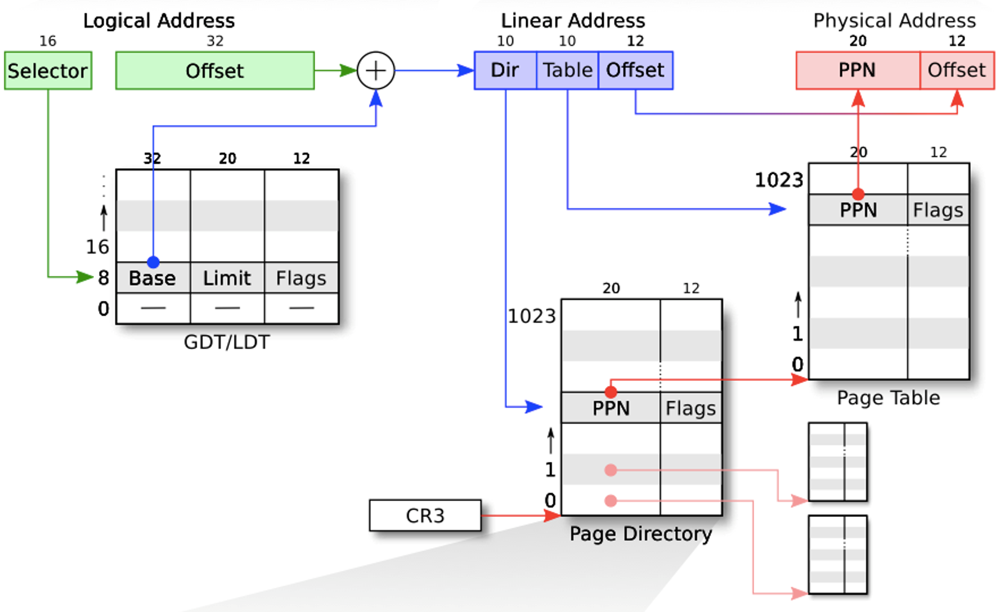
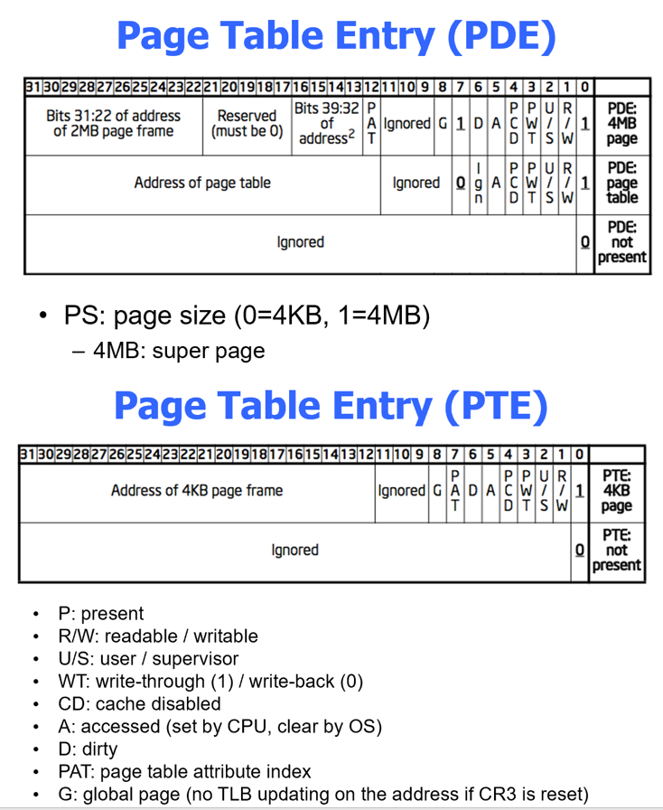
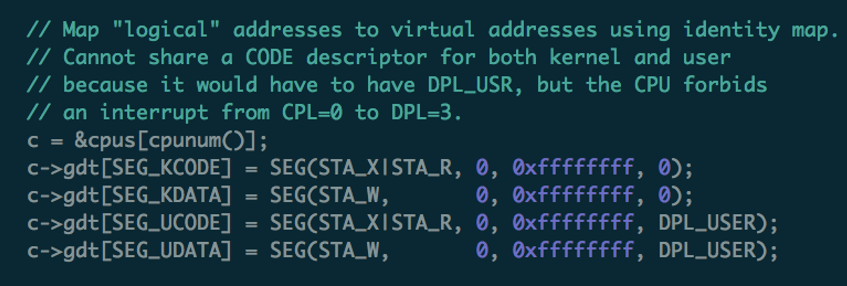
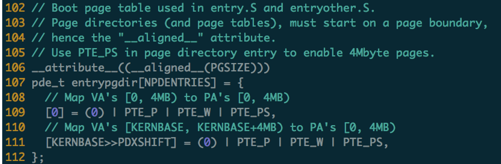
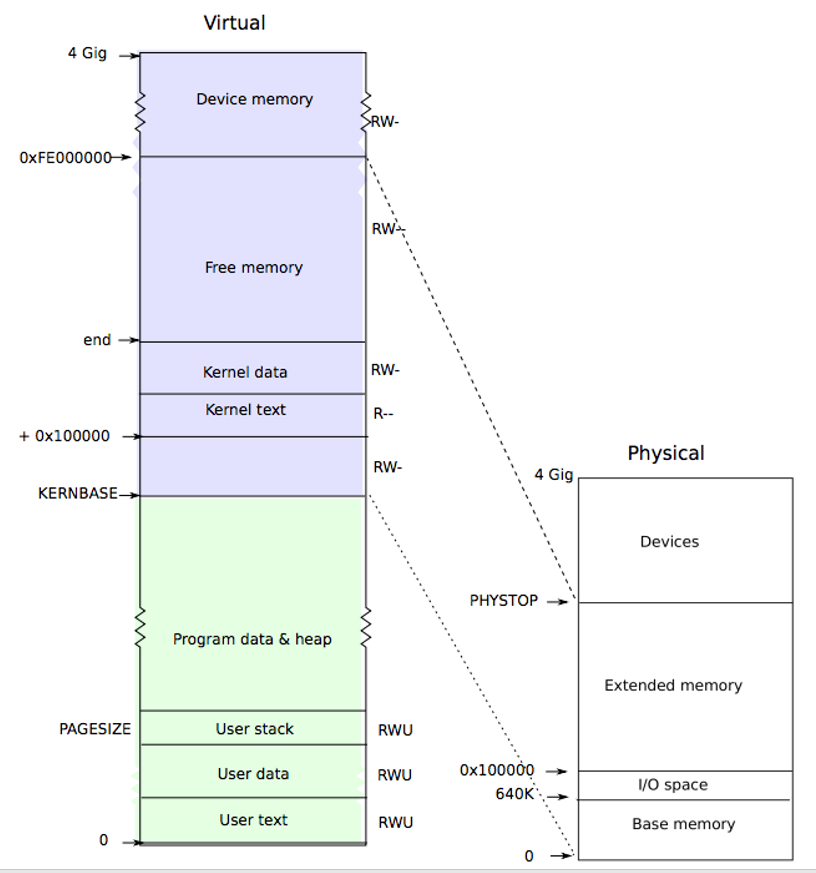

# Virtual Memory

## 1 Address translation

### 1.1 Protected mode

Logical Address → Linear Address → Physical Address

- **逻辑地址**（Logical Address）：是机器语言指令中，用来指定一个操作数或是一条指令的地址。要经过寻址方式的计算或变换才得到内存储器中的实际有效地址即物理地址。一个逻辑地址由两部份组成，**段标识符: 段内偏移量**。段标识符是由一个16位长的字段组成，称为段选择符。其中前13位是个索引号，后面3位包含一些硬件细节 。
- **线性地址**（Linear Address）：也叫**虚拟地址**(virtual address)。是逻辑地址到物理地址变换之间的中间层。如果启用了分页机制，那么线性地址可以再经过变换以产生一个物理地址。如果没有启用分页机制，那么线性地址直接就是物理地址（实模式中）。
- **物理地址**（Physical Address）：在没有使用虚拟存储器的机器上，虚拟地址被直接送到内存总线上，使具有相同地址的物理存储器被读写；而在使用了虚拟存储器的情况下，虚拟地址不是被直接送到内存地址总线上，而是送到存储器管理单元MMU，把虚拟地址映射为物理地址。

- **PDE** & **PTE** 结构：

- **superpage**：
  - **4MB** per page
  - when workload is **data-intensive**, using 4MB sized page will make the TLB more
    efficient, which avoids the costly TLB misses and reduces the average address
    translation time

### 1.2 PAE：Physical Address Extension

**32-bit** linear address → **36-bit**（or more） physical address

- **CR0.PG**=1 &&  **CR4.PAE** =1
- Maintains a set of 4 **PDPTE** registers（Page Directory Pointer Table Entry）
- 64-bit PTE

## 2 Memory Init

Booting: enabling segment and paging

- Segment: set GDT & use long jmp (ljmp)
- Paging: temporary page table (entrypgdir) with kernel mapped at both 0x80100000 and 0x100000

### 2.1 enable segment

- seginit

  

- 在启用segment之后，逻辑地址就会根据segment-base+offset被翻译成虚拟地址，但这时候虚拟地址中还没有装载有效的instruction（页表还没有映射），所以启用前后要确保地址是相同的
- 回忆booting中的`ljmp $(SEG_KCODE<<3), $start32` 切换到了保护模式，但是segment-base是0，所以这条指令之后还是继续执行下一条指令

### 2.2 enable paging

- 启用paging之后就会把地址当作虚拟地址，但是这时候还没有建立user-memory的映射关系，所以先把所有PA加一个kernel base偏移，即`KVA = PA + KERNBASE`

  

  