# Virtualization

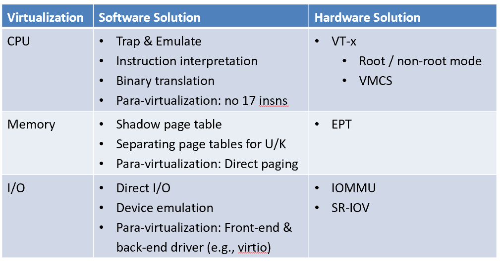

## 1. Virtualization概述

### 1.1 含义

Virtualization：

- 虚拟化就是在hardware layer和software layer之间的一个额外的software layer，对上提供和hardware layer相同的接口
- 性质：
  - 隔离性Isolation
    - Fault Isolation（核心）
    - Software Isolation（软件版本，动态库）
    - Performance Isolation（调度和资源分配）
  - 封装性Encapsulation
    - VM的state可以被当作一个file，就可以很方便进行修改和操作
  - 中介性Interposition
    - VMM监控VM的行为，可以拦截请求，根据需要进行处理
- pros：资源复用；便于移植和部署；安全；load balance
- cons：VMM不知道VM在干什么（OS知道）；

### 1.2 虚拟化方法

原则：

- 保持隔离：VM不可以访问到其他VM的数据
- 保持透明：不可以修改software

#### 1.2.1 架构&接口

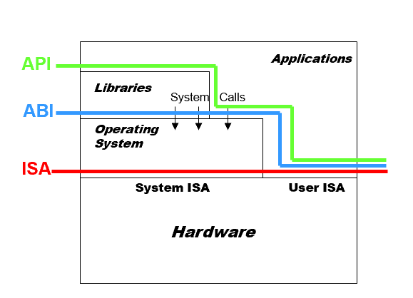

- **API**：application programming interface

  - 提供编程接口
  - 核心：Standard Library ( or Libraries )
  - 通常由高级语言源代码定义

- **ABI**：application binary interface

  - 连接**应用**和**系统**
  - 由**User ISA**和**System Call**组成

- **ISA**：instruction set architecture

  - 连接**操作系统**和**硬件**
  - 分为**User ISA**和**System ISA**：
    - User ISA：`mov $0, %eax`
    - System ISA：`cli`, `sti`, `mov $0, %cr0`

- 区分：

  ```asm
  # API: 底层是library/runtime
  # ABI：底层是OS
  # ISA：底层是硬件
  
  Hello world		API
  Web Game		API
  Dota			API
  Office 2013		API
  Windows 8		ISA
  Java app		ABI/API
  Python scripts	API 
  ```

- **Virtual Machine**:
  - 从process角度：ABI 提供process和machine的接口
  - 从system角度：ISA 提供system和machine的接口

#### 1.2.2 VMM

- 不同类型的虚拟化：

  - process虚拟化：VM控制process运行，但是VM和process都运行在user level
    - Language construction
    - Cross-ISA emulation
    - Application 虚拟化
  - device虚拟化：RAID
  - system虚拟化：VMM
    - VMware，Xen

- Design Space：

  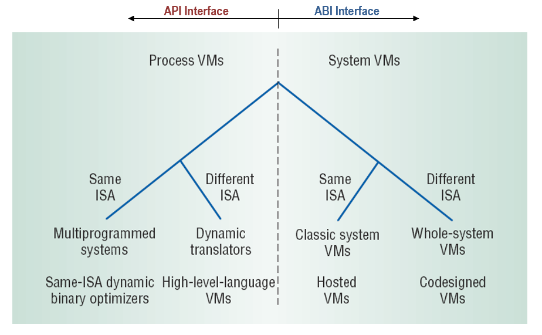

- System VMM 架构:

  - **Type1**：VMM直接运行在hardware上
    - 高性能
    - eg. Xen，VMware ESX Server
  - **Type2**：VMM运行在host OS上
    - 构建和安装方便快捷
    - VM就像是运行在Host OS上的一个application
    - 可以重用已经有的device驱动和OS support（FS，CPU scheduler）
    - eg. VMware Workstation

  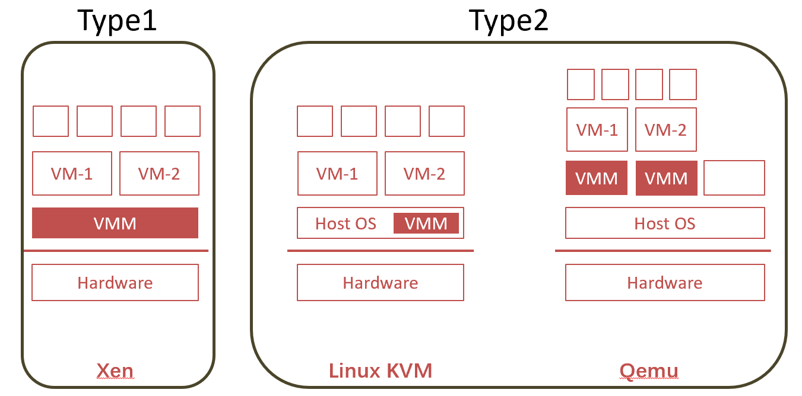

- **Hosted Monitor**：

  - **架构**：

    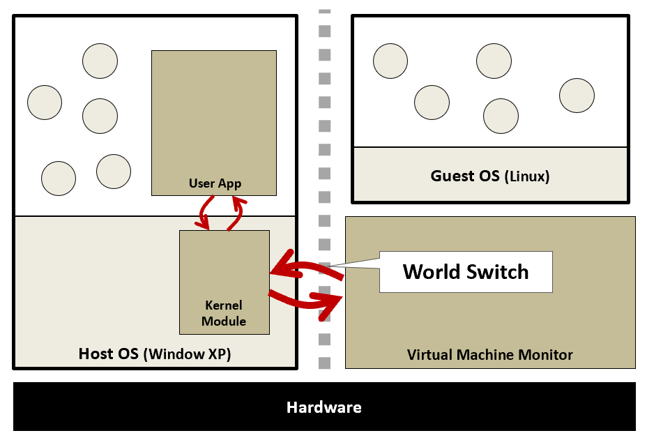

    - **world switch**：VMM运行在自己的地址空间（kernel level），和host OS共享hardware，user app通过world switch切换到VMM（VMM的初始状态是由user app来set up的）

    - **CPU/Memory virtualization**：CPU/Memory的虚拟化全部在VMM内部进行，VMM有权访问CPU的状态，这是为了更快的虚拟化

    - **Device I/O**：guest OS → VMM → Host OS kernel → user app → Host OS → hardware

    - **Interrupt**：VMM不处理device interrupt，只处理excepttion；

      Hardware  → VMM → Host OS

  - **调度**：

    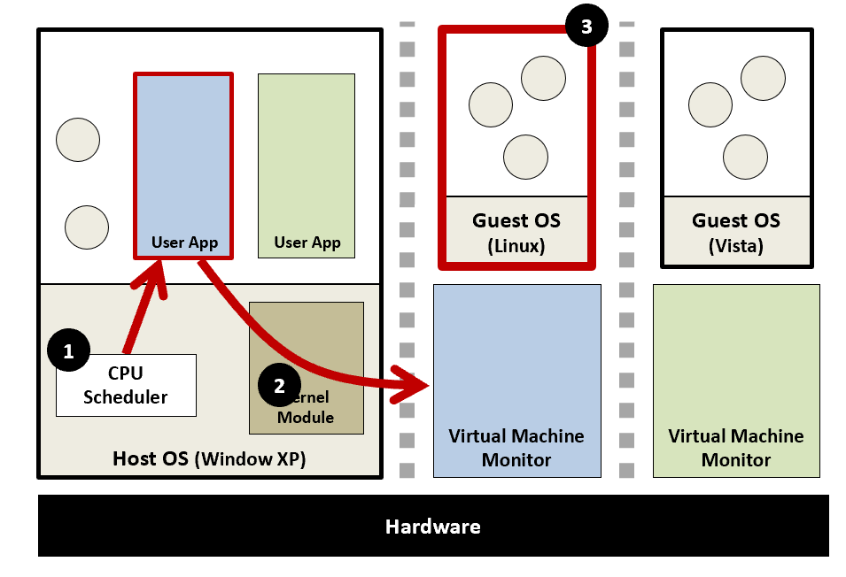

    - host OS的CPU调度user app
    - user app 通过world switch切换到VMM
    - VMM把时间片交给guest OS进行分配
    - 时间中断经过Hardware  → VMM → Host OS → CPU scheduler，调度另一个user app

  - **Pros**：安装和运行都和application一样

    - 不需要进行磁盘分区
    - 不需要重启

  - **Cons**：I/O比较慢；依赖host OS的调度

- **Hypervisor**：

  - 硬件支持的single-use monitor

  - 特性：

    - 小；
    - 运行在special hardware mode
    - Guest OS运行在普通权限级别

  - 用途：安全/系统管理/容错

    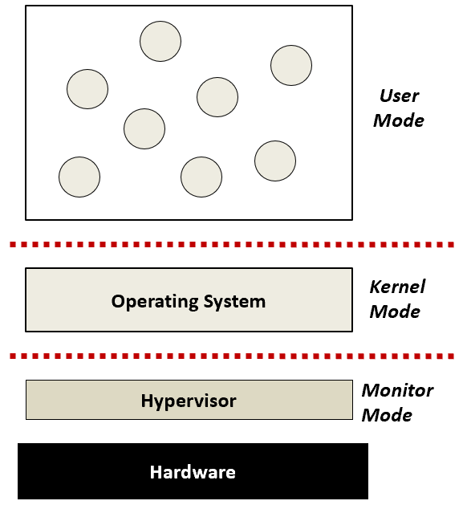

## 2. CPU虚拟化

- **问题**：VM中想要运行一些privilege instruction，但是这些指令不能在user mode运行（VM以为自己是kernel mode，实际上是user mode）
- **对策**：Trap & Emulate
  - **Trap**：运行privilege instructions就会trap到VMM
  - **Emulate**：VMM像实现函数一样实现这些privilege instructions
- **X86 is not Strictly Virtualizable**：有17条指令在user/kernel mode都可以运行，但是效果不一样，需要针对这17条指令进行特殊的处理

#### 2.1 Instruction Interpretation

- 方法：使用软件来模拟整个Fetch/Decode/Execute的流水线
  - 使用memory来模拟sytem status
  - 没有指令是真的在hardware运行的
- 举例：Bochs
- Pros：好实现
- Cons：很慢

#### 2.2 Binary Translator

- 方法：在execute之前，把二进制中的这些指令翻译成VMM实现的function call
  - basic block → code cache
- 举例：VMware，Qemu
- 问题：
  - 中断可能会在basic block中发生
  - 需要小心处理self-modifying code (SMC)

#### 2.3 Para-virtualization

- 方法：改OS让它与VMM相协调
  - OS处理那些特殊指令时就会call VMM，这种机制被称为hypercall
  - Hypercall也可以被看作一种trap
- 举例：Xen

#### 2.4 Hardware Supported CPU Virtualization

- 方法：**VT-x**

  - intel运用Virtualization虚拟化技术中的一个指令集

  - 提供两个新的mode：**root** mode/ **non-root** mode

    - VMX root operation：有完整的权限，专门给VMM的
    - VMX non-root operation：没有完整权限，用于guest software；减少guest依赖于ring的SW特权；解决ring aliasing和ring compression的问题
    - 都包含ring 0~ring 3四个特权级别

    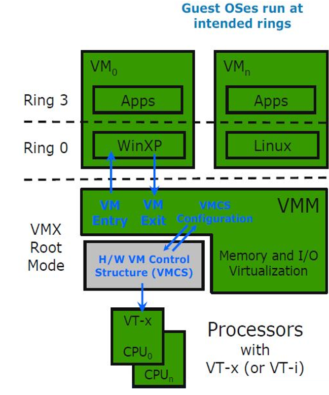

**VM Entry & VM Exit**：

​	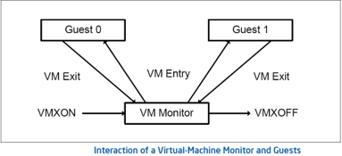

- VM Entry：

  - 从VMM切换到Guest的non-root mode
  - 从VMCS中加载guest的状态
  - 第一次进入时使用VMLAUNCH，后续使用VMRESUME

- VM Exit：

  - 从Guest切换到VMM的root mode
  - 把guest的状态保存到VMCS中
  - 从VMCS中加载VMM的状态

  

**VMCS：VM Control Structure**

- 包括六个logical group：
  - **Guest-state area:**  VM exit 时保存， VM entrie时加载
  - **Host-state area:** VM exit 时加载
  - **VM-execution control fields:** 控制non-root mode下的processor操作
  - **VM-exit control fields:** 控制VM exit
  - **VM-entry control fields:** 控制VM entry
  - **VM-exit information fields:** 记录VM exit的原因和情况，是只读的

- 每个VM有一个VMCS

  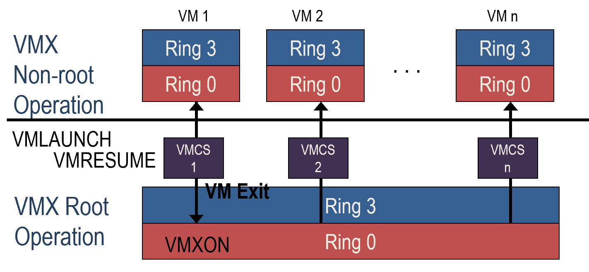

## 3. Memory虚拟化

-  问题：存在3种地址
  - **GVA**->**GPA**->**HPA** (Guest virtual. Guest physical.
    Host physical)
  - Guest VM的page table中映射了GVA**->**GPA
- 需要处理翻译到HPA的过程，因为直接把host的CR3指向GPT是不可行的

### 3.1 Shadow Paging

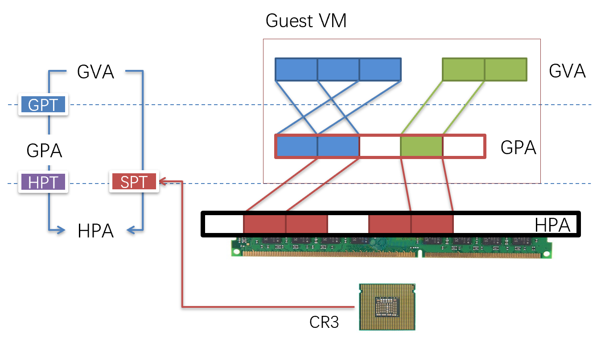

- 流程：
  - VMM拦截guest OS想要设置虚拟CR3的请求
  - VMM根据GPT和HPT构建出对应的SPT，把GVA翻译成HPA
  - 把SPT中的HPA加载进来
- Guest OS改GPA时，SPT也要进行更新
  - 可以通过把GPT的PTE权限设置为read-only，这样改的时候就会触发pg fault，VMM就知道要改了
- Guest OS中也会有kernel/user mode，为了保护kernel-only的page，需要**两个SPT**
  - 当guest OS切换mode的时候，VMM切换SPT

### 3.2 Direct Paging

- 方法：修改guest OS
  - 不需要GPA，直接GVA → HPA
  - guest OS直接管理HPA的地址空间
  - 使用hypercall来让VMM更新页表
    - VMM来检查对PT的操作，PT对guest OS是只读的
  - CR3直接指向GPT
- pros：
  - 容易实现
  - 性能好
- cons：
  - 对于guest OS来说是不透明的
  - guest OS知道太多HPA的信息，可能会恶意利用

### 3.3 Hardware Supported Memory Virtualization

- 方法：

  - NPT（Nested Page Table）

  - **EPT**（Extended Page Table）

    - 翻译GPA → HPA

    - 由VMM控制

    - 每个VM有一个EPT

    - 缺点：对memory的访问次数太多

      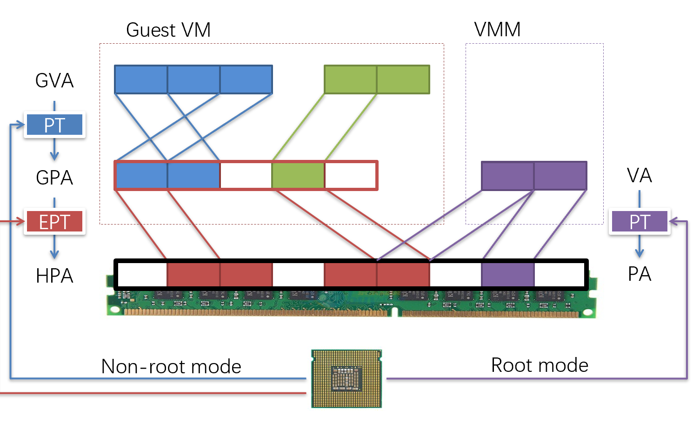

### 3.4 Page Table的隔离

- 目的：避免Meltdown攻击

- 现有的方法：**KPTI** (Kernel Page Table Isolation)

  - 设置两个页表，mode切换时切换页表
    - User page table only maps user space
    - Kernel page table maps both user and kernel space
  - 这个方法不适用cloud environment

- **EPT-based Kernel Space Isolation**

  - 法一：直接移除EPT-u的kernel mapping（×）

    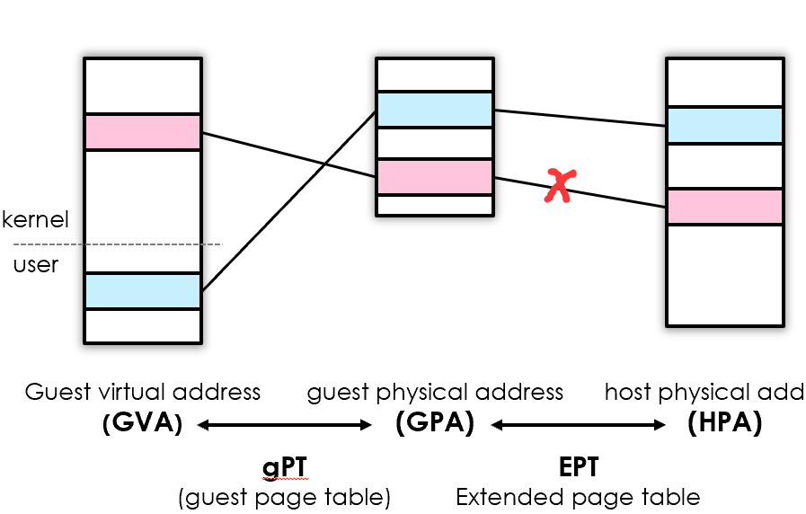

    - kernel-used和user-used GPA是无法区分的

  - 法二：把EPT-u中的GPT的kernel space清零

    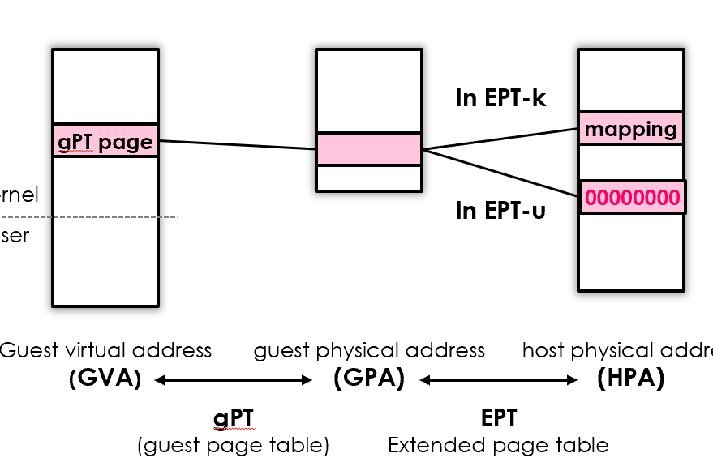

    - 需要追踪GPT中的level-3页表（kernel GL3），然后重新映射到0的区域
    - 太多的trap会影响性能

## 4. KVM&QEMU

### 4.1 KVM

- 是Linux的一个虚拟化模块（/dev/kvm）【kernel mode】

  - 使用Linux的functions实现memory管理和process调度
  - 使用Trap&Emulate进行CPU虚拟化
  - 使用EPT来进行memory虚拟化
  - 使用Qemu（方便）/SR-IOV（性能）/VirtIO（半虚拟化）来进行IO虚拟化

- 运行qemu来创建VM，一个qemu是一个process，对应一个VM【user mode】

  - VM退出，Qemu也退出；VM重启，qemu不用重启
  - Qemu分配memory（GPA）

  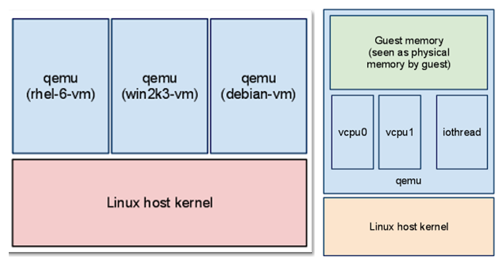

### 4.2 KVM Execution

Host视角：

- kernel像调度一个常规process那样调度Qemu
- host不知道guest OS中运行的process运行的情况
- Guest中，每个虚拟CPU对应一个vcpu线程
- iothread运行时不断轮询来处理I/O事件

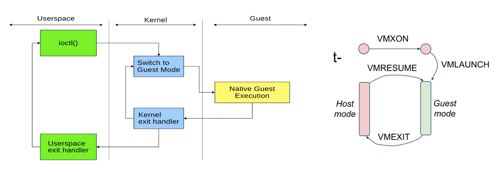

- ioctl()：
  - kernel找到VMCS
  - 调用VMEntry来装载VMCS中的状态
  - 切换到VM（root → non-root）
  - IP ← VMCS.IP，开始运行VM的代码

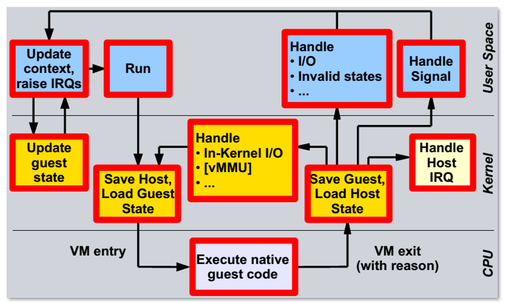

KVM Model优点：

- 只有一个地址空间切换：guest ←→ host，需要的调度更少
- 大量的Linux kernel的重用
- 大量的Linux user land重用

## 5. I/O虚拟化

### 5.1 Emulated（full-virtualized）

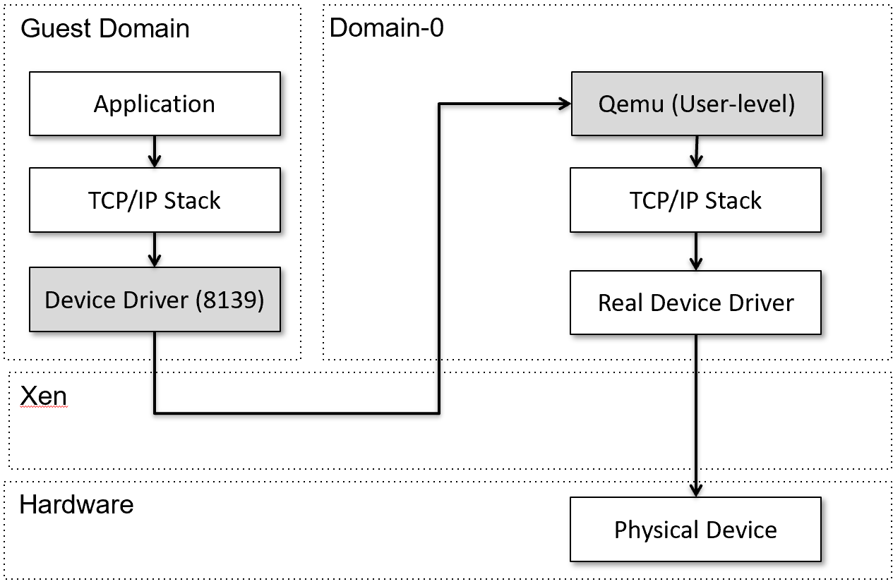

- Qemu的device emulation
  - user application运行在domain-0
  - 使用软件实现了NIP（Network Interface Controller）
  - 每个VM都有对应的Qemu实例
- I/O请求的重定向：
  - I/O request → domain-0 → Qemu → NIC驱动
- Pros：
  - 平台稳定性
  - 允许中间进行请求的拦截和干涉
  - 不需要特殊的硬件支持
- Cons
  - 慢
  - 需要在VMM或Host中有硬件的驱动

### 5.2 Para-virtualized

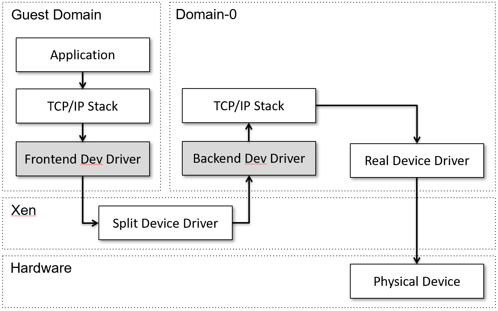

- **Para-virtualized**

  - 方法：
    - VM把请求发送给monitor的高等级抽象层次
    - monitor发起请求
    - guest和monitor之间共享buffer
  - Pros：
    - monitor被简化，就很快
  - Cons：
    - monitor需要支持guest-specific的驱动
    - 需要引导程序

- **VirtIO：Unified Para-virtualized I/O**

  - motivation：Linux支持8个虚拟化平台，每个都有自己的para-virtualizatied I/O接口，VirtIO为这些para-virtualizatied device提供了一个统一的I/O mode

    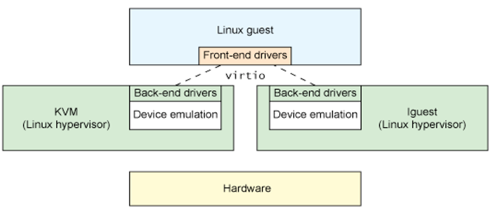

  - VirtIO是一个框架和驱动的集合

    - protocol：一个hypervisor无关、domain无关、总线无关的协议，用作传输缓冲区
    - binding layer：一个连接层来把VitrIO连接到bus上
    - 特定Domain的guest驱动（network，stroge，etc）
    - 特定hypervisor的host支持

  - VirtIO中的disk read request流程

    ```c
    1. VM 填写request描述符（header-data buffer-footer）
    2. VM 写virtio-blk的virtqueue notify register，请求被发送到QEMU
    3. QEMU发起读请求，把数据读到buffer中
    4. QEMU填写请求描述符中的footer，然后注入完成中断信号
    5. VM收到了中断，执行handler
    6. VM从buffer读取数据
    ```

- QEMU中的Storage：

  - Block驱动分为两个部分：

    - Formats：镜像文件格式
    - Protocols：I/O传输协议

    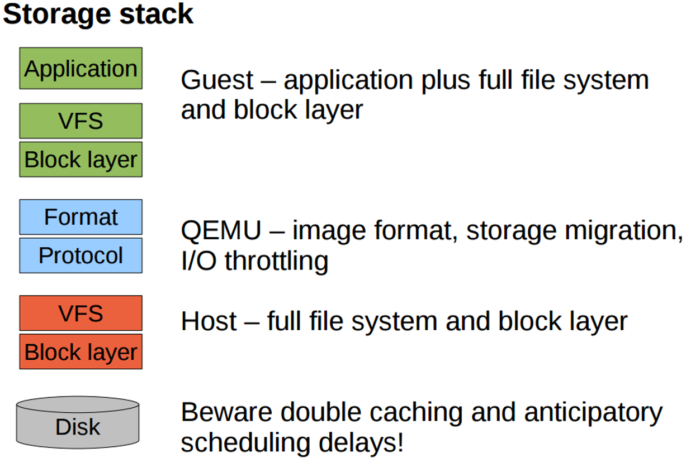

### 5.3 Direct Access (Passthrough)

- **Directed I/O**：

  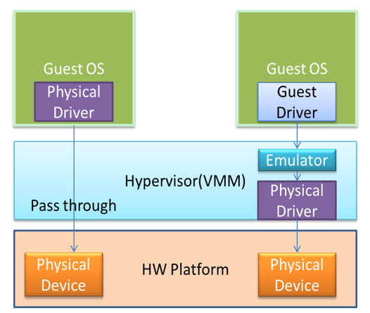

  - 理念：允许VM直接访问device

  - Pros：

    - 快
    - 很好监控（只需要有限的驱动）

  - Cons：

    - 需要硬件保证safety（IOMMU）

    - 需要硬件支持复用

    - VM可见硬件接口，限制了VM的可移植性

    - 很难进行中继的拦截和干涉

      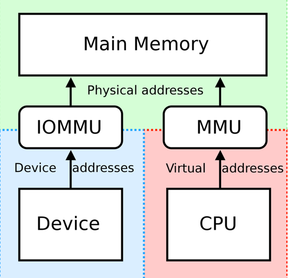

### 5.4 Hardware assisted I/O virtualization

#### 5.4.1 VT-d

**VT-d**：Intel的Direct I/O虚拟化技术

- **地址翻译**：定义了一个多级页表结构用于DMA地址翻译
- **DMA-remapping**：把GPA翻译为HPA，同时进行权限检查
- **Interrupt Remapping**：不使用硬件来把中断暴露给guest，而是重新定义了interrupt-message的format，在中断请求里面指明requester-ID和interrupt-ID，使用硬件把中断重新映射成一个物理中断
- 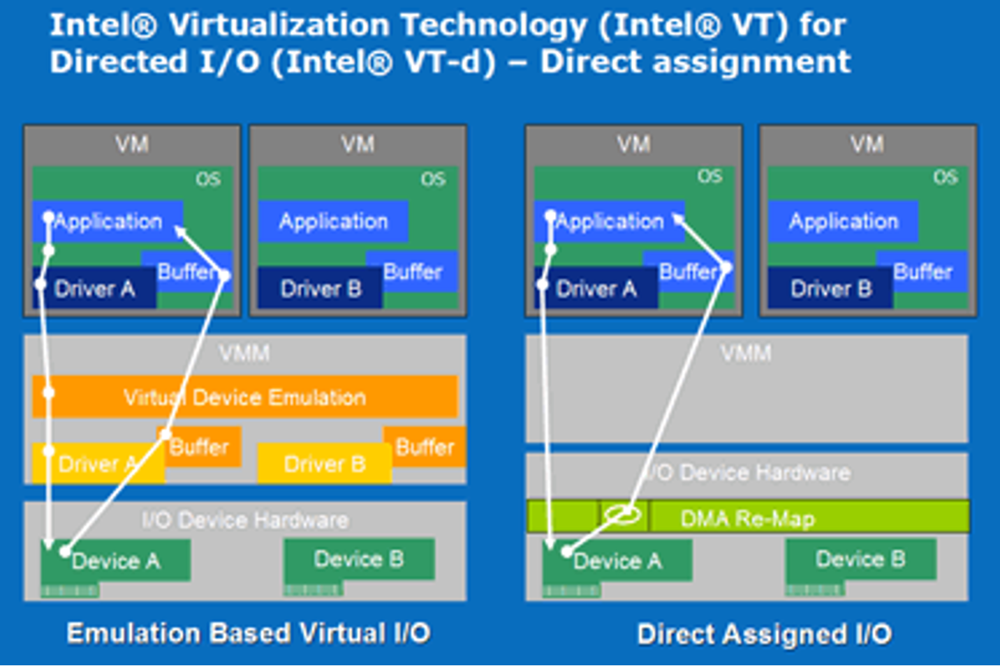

- 缺点：一个物理设备只能给一个VM使用，可扩展性不好

### 5.4.2 SR-IOV

**Single Root I/O（SR-IOV）**：Device multiplexiing

- SR-IOV 技术是一种基于硬件的虚拟化解决方案，是一个快速外设组件兴趣组（Peripheral Component Interconnect Special Interest Group，PCI-SIG）规范

- SR-IOV 规范定义了新的标准，根据该标准，设备可以被多个VM共享

  - VM与PCI直接与I/O设备相连，不需要VMM来管理系统资源

- SR-IOV 标准允许把PCI function或分为多个虚拟接口，从而在虚拟机之间高效共享 PCIe（Peripheral Component Interconnect Express，快速外设组件互连）设备

  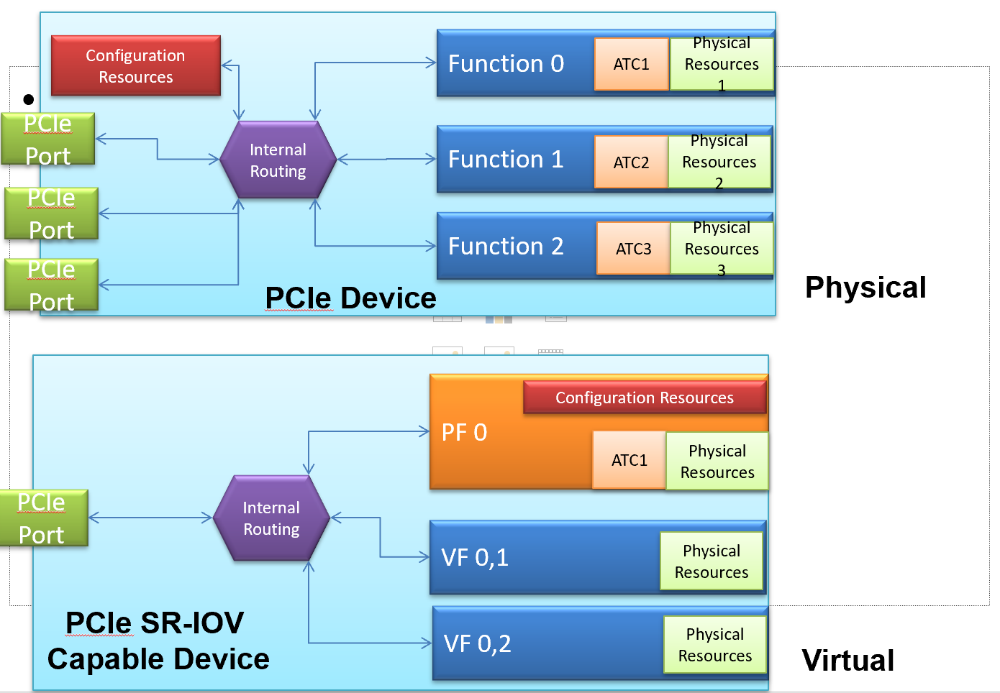

  - PCIe会有多个virtual function（VF），一个VM可能会使用多个VF
  - security由以下设计保障：
    - 每个VF中的独立的控制结构
    - I/O地址翻译设备（VT-d）
    - 中断remapping机制（VT-d）

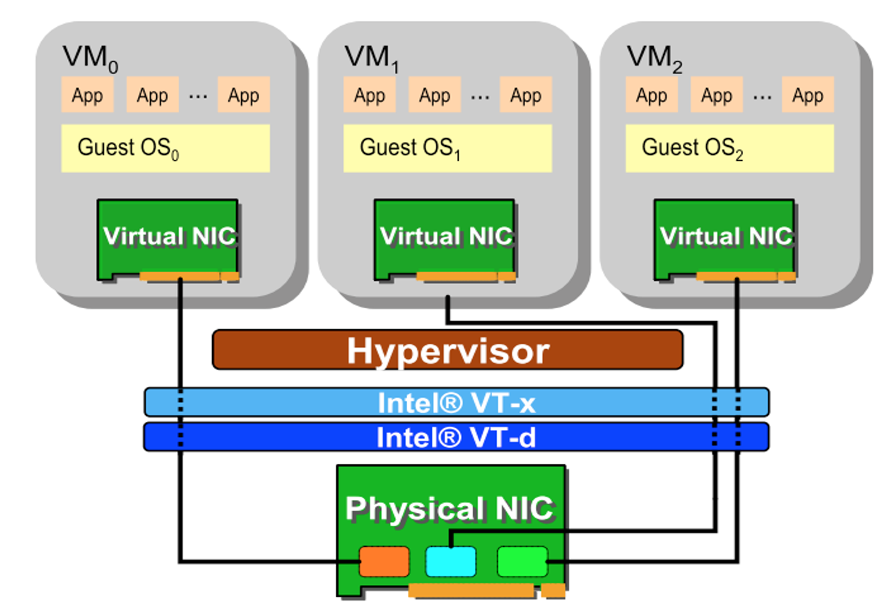

#### 5.4.3 Intel 虚拟化技术全集

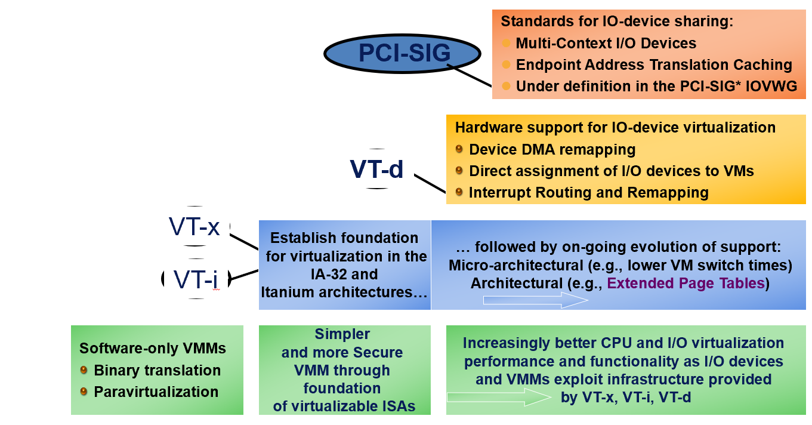

## 6. 其他

- CloudVisor

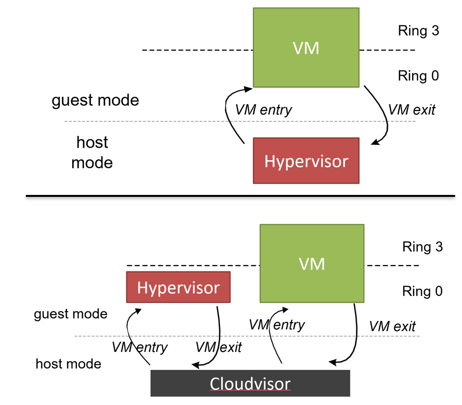

