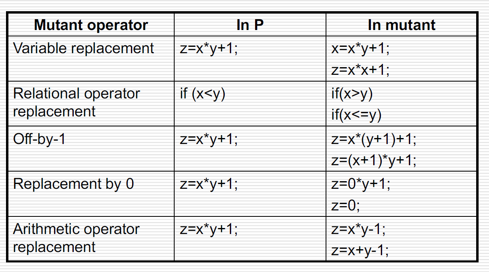
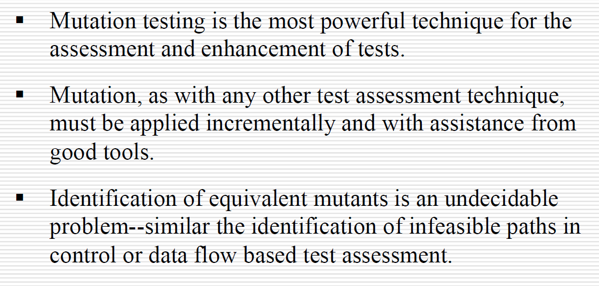
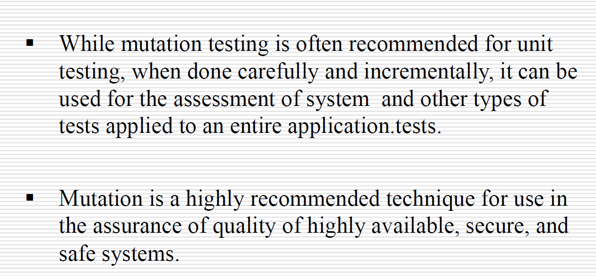

# 变异测试

如何测试一组测试用例？这组测试用例已经充分检测了程序的缺陷了吗？

使用**变异测试**来检验测试用例：

1. 使程序单元通过所有测试用例
2. 对程序单元进行微小的改动
3. 在突变体上运行测试用例
4. 运行通过→存在未被检测到的变异（改动产生逻辑等效的程序/该组用例不具备检测这个变异的能力）

## 1.

- **突变体**$P^`$：改变原始程序$P$的源代码的结果
- 对于源程序已全部通过的一组测试用例$T$，如果其中的至少一个测试用例使$P^`$运行失败，则突变体$P^`$被**杀死**
- 对于源程序已全部通过的一组测试用例$T$，如果$P^`$也通过了其中的每一个测试，则突变体$P^`$**存活**，这样的变异体称为原程序的**等价变异体**
- 给定程序$P$和其突变集合$M$，测试用例集$T$导致$M$的$y$个突变体中有$x$个被杀死，则称比率$x/y$为$P$关于$M$的**变异分数**

## 2.

变异测试可以用于：

- 检验测试用例的**adequacy**
  - 变异分数是否为1
- **强化**测试用例
  - 添加测试用例→重新测试→……→变异分数为1
- 检测error
  - 假设对于测试用例$t$，$P^`(t)\neq P(t)$且$P(t)\neq R(t)$，其中$R(t)$指的是期待的$P$关于$t$的输出，则称$P`$是一个**error revealing**的变异

## 3.

能够杀死变异体的测试用例要具备以下特性：

- **可达性**：覆盖变异语句
- **传染性**：执行完变异语句后会改变程序的状态
- **传播性**：程序的状态改变会引起输出的改变

## 4. 突变算子

突变算子一般使用相同的语法元素几何的一个成员来替代另一个成员，从而实现突变体的创建

- 算术运算符：$\{+,-,*,/,\% \}$
- 关系运算符：$\{<,<=,==,\neq,>,>= \}$
- 逻辑连接符：$\{\and,\or,\oplus,\sim,\to  \}$

突变算子对simple mistake进行了建模

突变算子对编程语言会有一定的依赖

## 5. CPH & Coupling effect

Competent programmer hypothesis（CPH）：

- “a programmer writes a program P that is in the general neighborhood of the set of correct programs.”
- 有错的程序与正确的程序通常也就几个变异的差别
- 突变算子能够模拟熟练程序员的错误

Coupling effect：

- “Test data that distinguishes all programs differing from a correct one by only simple errors is so sensitive that it also implicitly distinguishes more complex errors”
- 小的变异测试可能会导致发现大的程序缺陷

## 6. 总结

