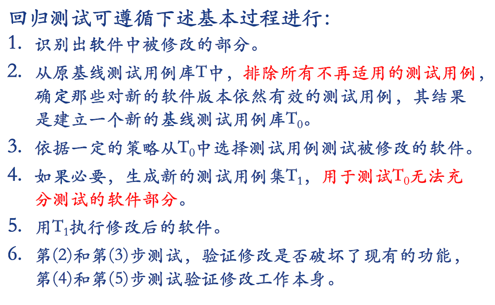
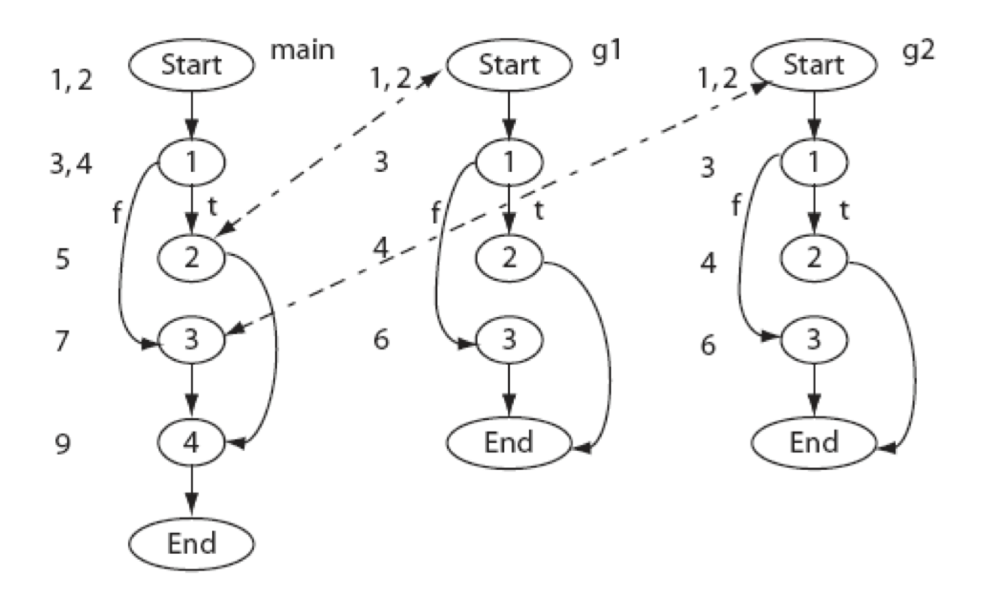
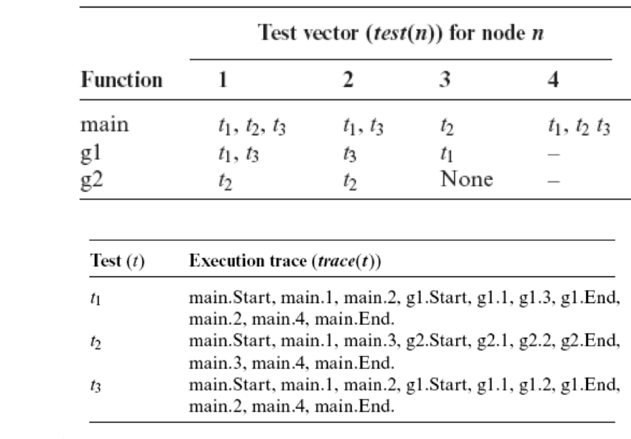
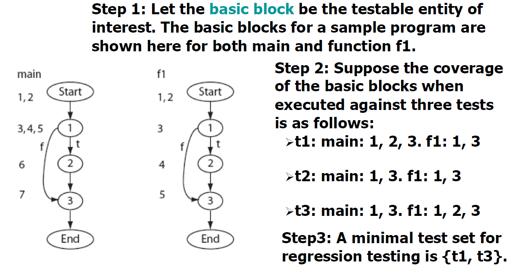

# 回归测试

每当软件发生变化，就需要重新测试现有的功能，以：

- 软件修改是否达到预期目的
- 修改是否损害了原有正常功能
- 补充新的测试用例
- 验证修改的正确性和影响

选择回归测试策略应兼顾**效率和有效性**：

- **test-all**：测试全部用例，测试成本高
- **基于风险**选择：运行最重要/关键/可疑的测试，逐步降低风险值
- **基于操作剖面**选择：优先选择针对最重要/最频繁使用功能的测试用例
- 测试**修改部分**：测试局限于被改变的模块和它的接口

------

## 1. Test selection using execution trace and execution

1. 构造程序$P$和测试集$T$的执行流**execution trace**（CFG）
2. 为$P$中的每个节点找到对应的**test vector**（哪些test的执行流经过了这个node）
3. 构造$P$和$P^`$中每个node的syntax tree
4. 遍历CFG找到$P^{`}$需要的$T$的子集

假设有程序CFG：

其中每个节点的test vector为

假设$P^`$中对$P$的$g1$做了修改，则回归测试的测试集为$\{t_1,t_3\}$

## 2. Test selection using test minimization

1. 识别出不同的**testable entity**
2. 识别出测试集$T$中每个测试用例覆盖了哪些entity
3. 找到一个最小的$T$的子集$T^`$，覆盖了所有的entity

## 3. Test selection using test priorization

1. 识别出不同的**testable entity**
2. 识别出测试集$T$中每个测试用例覆盖了哪些entity
3. 根据每个测试用例覆盖的entity数量进行排序，有更大coverage的用例有更高的priority（这个排序的标准可能根据场景的不同而发生变化）
4. 根据可用的资源数量或者其他因素选择要使用多少测试用例

## 4. 总结

1. 回归测试在软件开发过程中很重要
2. 当测试资源有限/时间紧时，test-all策略是不可行的
3. 精巧的test-selection能帮助减少回归测试的时间