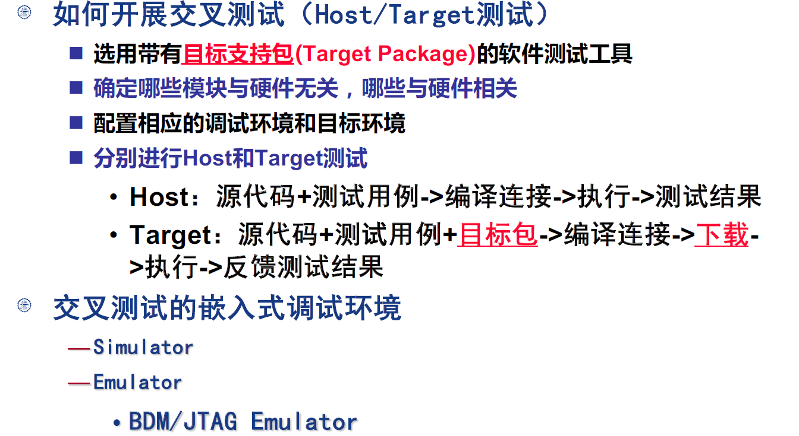

# 嵌入式测试

嵌入式测试的基本方法：

- 借用PC软件的测试方法
  - 静态/动态
  - 白盒/黑盒
  - 单元/集成/系统
- 全数字模拟测试
- 交叉测试
- 真实环境验证

## 1. 静态/动态测试

静态分析/测试：

- 含义：不执行代码，静态查找代码中可能存在的错误，评估代码质量
- 方法：代码规则审查/代码统计分析/软件工程度量（各种复杂度）
- 原因：80%的软件错误来自编写语言的错误使用，这些错误不是功能测试能解决的

动态测试：

- 含义：设计测试用例，运行被测程序，验证其功能、性能，检查代码执行情况
- 方法：黑盒/白盒等

## 2. 全数字模拟测试

采用数学平台方法，将嵌入式软件从系统中剥离出来，通过开发CPU指令、常用芯片、I/O、中断、时钟等**模拟器**，在HOST上实现嵌入式软件的测试

**特点：**

**局限性：**

## 3. 交叉测试

- 在HOST（PC）上完成与环境无关的部分
  - 在硬件环境没有搭建好或者测试工具缺乏时就可以开始
  - 可以借用PC软件的测试方法
  - 适用于高级语言，可利用高级语言的可移植性
- 在Target上完成于硬件密切相关的部分
  - 需要调试环境支持
  - 测试工具需要支持Target环境
  - 要Target资源
- 在目标环境中确认
  - 注意HOST和Target的环境差异

## 4. 软件测试策略

### 4.1 先静后动，先单元后集成，先黑盒后白盒

### 4.2 对代码进行结构化分析

### 4.3 根据环境交叉测试

### 4.4 选择合适的测试工具，做好管理

- 对测试集进行维护和更新
- 回归测试
- 缺陷追踪

