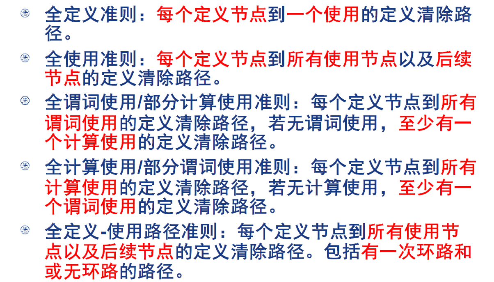

# 白盒测试

- **含义**：将测试对象看作一个透明的盒子，充分利用其逻辑结构和有关信息设计和选择测试用例
- **同义词**：结构测试/逻辑驱动测试
- 力求提高测试覆盖率
- 主要用于单元测试

------

## 1. 路径测试

### 1.1 DD路径

- DD路径（decision-to-decision path）指**从判断到判断**的路径

- 对于程序来说，DD路径是一个有向图，节点对应程序中的语句片段，边表示控制流

- DD路径是一种压缩图

  

  

### 1.2 测试覆盖指标

E.F.Miller的覆盖度量方法

对于程序：

- 语句覆盖：A=2，B=0，X=3
- 分支覆盖：覆盖abcde
  - A=3，B=0，X=1（acd）
  - A=2，B=1，X=3（abe）
- 条件覆盖：覆盖所有判断中的条件取值
  - A=2，B=0，X=4（ace）
  - A=1，B=1，X=1（abd）
- 多条件覆盖：覆盖每个判断表达式的条件取值的各种组合
  - 多条件覆盖不能保证所有可能执行的路径覆盖
- 分支/条件覆盖：
  - 使分支的每个条件取到各种可能的值，并使每个分支取到各种可能的结果
- 路径覆盖：覆盖所有可能的执行路径（abd/abe/acd/ace）

### 1.3 循环测试

### 1.4 基路径测试

- **基路径**：程序图中**相互独立**的**一组**路径，使得程序中的所有路径都可以用基路径的组合表示（类比基向量）
  - 必须是从起始点到终止点的路径
  - 对于循环而言，基本路径应包含不执行循环和执行一次循环的路径
- **圈复杂度**：$V(G)=e-n+2p$
  - e：边数，n：节点数，p：连通区域数
  - 
  - $v = 10 - 7 + 2*1 = 5$
  - p1[A,B,C,G],P2[A,B,C,B,G],P3[A,B,E,F,G],P4[A,D,E,F,G],P5[A,D,F,G]
- 寻找McCabe基路径：深度优先/广度优先算法
- **基路径覆盖**可以保证DD路径覆盖
- McCabe圈复杂度的意义还在于**改进程序设计**

## 2. 数据流测试

数据流测试考察**变量**的**定义点**和**使用点**的路径

### 2.1 定义-使用路径

#### 2.1.1

- **DEF（v,n）**：在n节点处**定义**变量v
- **USE（v,n）**：在n节点处**使用**变量v
  - **P-USE（v,n）**：**谓词**使用
  - **C-USE（v,n）**：**计算**使用
- **du-path**：**定义使用**路径，开始于定义节点，结束于使用节点
- **dc-path**：**定义清除**路径，开始于定义节点，结束于使用节点，且该路径中没有其他节点是定义节点

#### 2.1.2 覆盖指标

### 2.2 程序片

变量$v$在程序语句$n$上的一个**切片**$S(v,n)$是程序中在语句$n$以前**对$v$的变量值做出贡献的所有语句的集合**

换言之，删去一个语句，如果$v$的值不发生变化，则不属于$S(v,n)$

## 3. 结构性方法的评估指标

使用**功能性测试技术**$M$生成$m$个测试用例，使用被测的$s$个元素的**结构性测试指标**$S$来跟踪测试用例

当执行$m$个测试用例经过了$n$个结构性测试单元时，

- 方法$M$关于指标$S$的**覆盖**：$C(M,S)=n/s$
- 方法$M$关于指标$S$的**冗余**：$R(M,S)=m/s$
- 方法$M$关于指标$S$的**净冗余**：$NR(M,S)=m/n$

## 4. 总结

