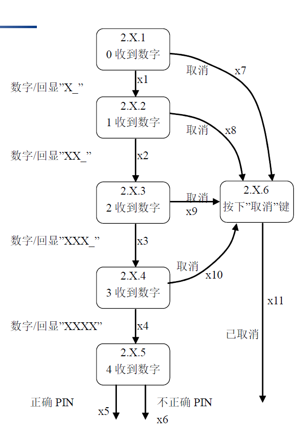

# 集成测试和系统测试

| 类别     | 对象               | 方法                               | 目的     | 测试人员     |
| -------- | ------------------ | ---------------------------------- | -------- | ------------ |
| 集成测试 | 针对模块之间的关系 | 需要了解程序的机构，进行结构化测试 | 路径覆盖 | 软件开发人员 |
| 系统测试 | 针对整个系统的功能 | 不需要了解程序结构，进行黑盒测试   | 功能覆盖 | 需要用户参与 |

------

## 一、集成测试

### 1. 基于功能分解的集成

- **自顶向下集成**：用**桩程序（stub）**模拟被调用程序。完成顶层测试后，用真实程序替代stub，进行下一层测试
- **自底向上集成**：用**驱动器**模拟对测试节点的调用。完成底层测试后，用真实程序替代驱动器，进行上一层测试
- **三明治集成**：同时从顶层和底层向中间集成，可以减少stub和驱动器数量
- **大爆炸测试**：不分层次，所有节点一起编译一起测试

### 2. 基于调用图的集成

- **成对集成**：
  - 每次调用**一对**程序
  - 测试数量：边数
- **相邻测试**：
  - 每次调用**一组相邻节点**（直接前驱结点-中心节点-直接后继节点）
  - 测试数量：不确定

### 3.基于路径的集成

#### 3.1

- **源节点**：程序开始/重新开始处的语句片段
- **汇节点**：程序结束处的语句片段
- **执行路径**：从源节点开始，汇节点结束，且中间没有插入汇节点
- **消息**：通过消息，控制从一个单元转移到另一单元

#### 3.2 MM路径

MM路径是穿插出现**模型执行路径**和**消息**的**序列**

**定义**：MM路径是一种有向图，节点表示模块执行路径，边表示消息（实线）/返回（虚线）

- DD路径：模块内的程序执行路径
- MM路径：模块间的模块执行路径的序列

**UML序列图**是MM路径图的表示方式，可以作为集成测试的覆盖标准

**复杂度**：同圈复杂度$V(G)=e-n+2*p$

### 4. 总结

## 二、系统测试

系统的功能是通过系统的**输入输出**来分析的

### 1. 线索

| 线索         | 形式             | 含义                 | 意义                 |
| ------------ | ---------------- | -------------------- | -------------------- |
| 单元级线索   | DD路径           | 模块内的路径执行序列 | 有意义的最小单元     |
| 集成测试线索 | MM路径           | 模块间的路径执行序列 | 小于系统级的意义单元 |
| 系统级线索   | 原子系统功能序列 | 系统输入到输出的路径 | 功能的最小单元       |

### 2. 原子系统功能

**ASF（原子系统功能）**：在系统层可以观察得到的端口输入和输出事件的行动

- **事件静止特性**：一个端口输入事件+N*MM路径+一个端口输出事件
- **事件序列原子化特性**

**ASF图**：一种有向图，节点表示ASF，边表示串行流

- **源ASF**：ASF图中的源节点
- **汇ASF**：ASF图中的汇节点
- **系统线索**：从源ASF到汇ASF的路径

### 3. 基于规格说明的系统测试

**有限状态机（FSM）**是研究系统级线索的有效手段。有限状态机就是ASF图

- 节点：ASF
- 边：事件和行动

用例的选择就是考虑对线索（从源ASF到汇ASF的路径）的覆盖

### 4.覆盖率评价指标

#### 4.1 基于事件的线索测试

输入：

- PI1：易于达到
- PI2：基本可行
- PI3：可能测试爆炸
- PI4/5：供参考

输出：

- PO1：基本要求
- PO2：难以满足

#### 4.2 基于端口的线索测试

以端口设备为中心，考虑端口到事件的一对多测试

#### 4.3 基于数据的线索测试

