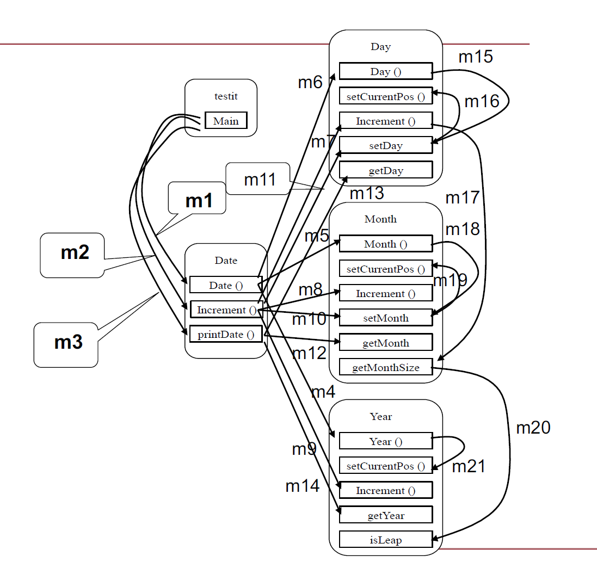
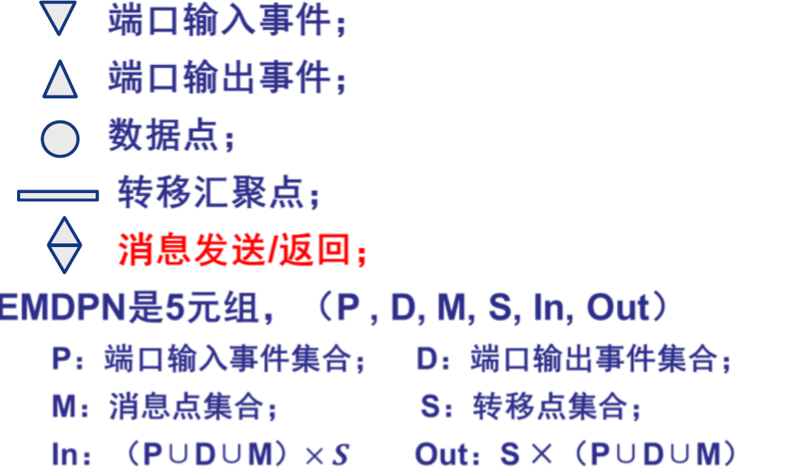
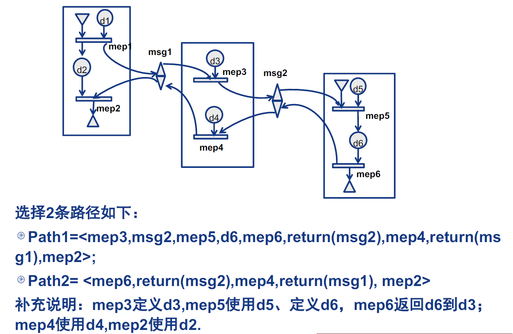

# 面向对象测试

四个层次

- 操作/方法 → 单元测试
- 类 → 单元/交互测试
- 集成 → 集成测试
- 系统 → 系统测试

## 1. 类测试

### 1.1 以方法为单元

等价于单元测试，使用传统黑盒/白盒测试技术

### 1.2 以类为单元

- 对一个方法的测试会包含对其他方法的调用
- 不设计新的桩程序/驱动程序
- 关心类的状态的变化

## 2. 面向对象集成测试

利用UML图，尤其是时序图（时序图相当于一个完整的MM路径）

### 2.1 面向对象软件的MM路径

注意不同类之间的消息调用

### 2.2 面向对象软件的数据流

事件消息驱动的Petri网——**EMDPN**（Event Message Drive Petri Net）

例子

