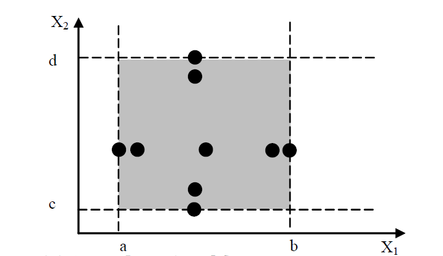
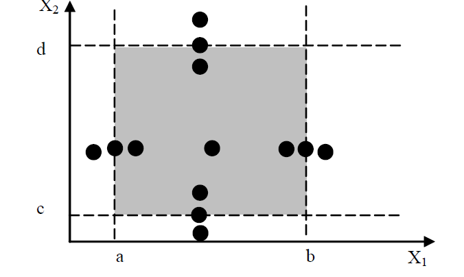
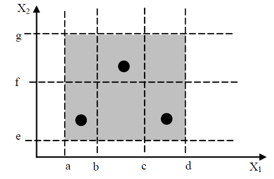
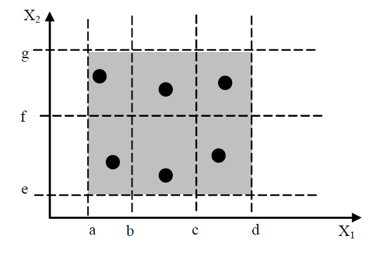
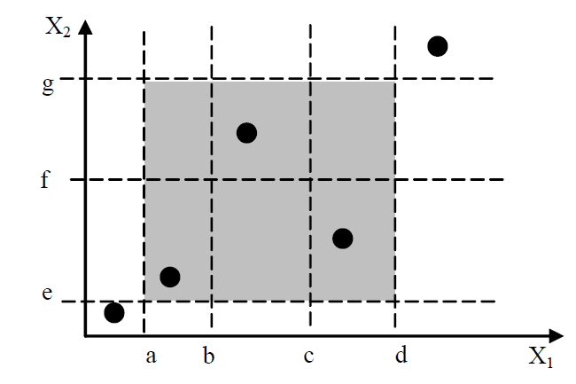
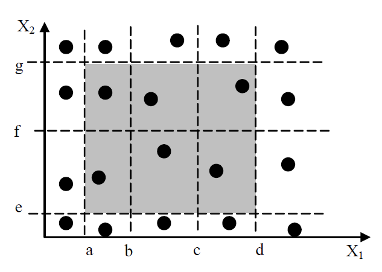
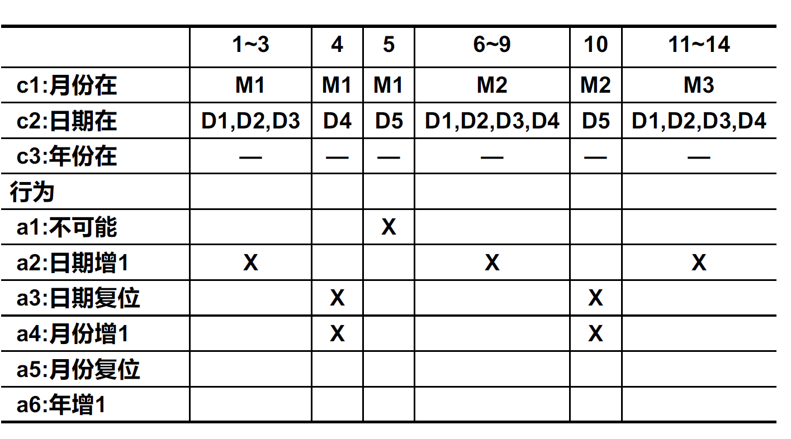
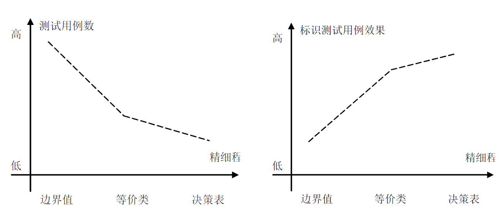

# 黑盒测试

- **含义：**把测试对象看作一个黑盒子，完全不考虑程序内部的逻辑结构和内部特性，只一句程序的需求规格说明书，检查程序的功能是否正确
- **同义词：**功能测试/数据驱动测试/基于规格说明的测试
- **目的：**
  - 是否有错误或遗漏的功能？
  - 输入能否正确接收？输出是否正确？
  - 是否有数据结构错误或外部信息访问错误？
  - 是否考虑了软件出错的情况？

------

## 1、 边界值测试

基于变量的值域构造测试

### 1.1 边界值分析

- 基于单缺陷假设（失效不由两个或多个故障同时引发）

- 测试5个边界值：**min、min+、norm、max-、max**

- 构造方法：每个用例中仅让一个变量取极值，其他变量取正常值

- N个变量测试用例数：$4N+1$

  

### 1.2 健壮性测试

- 基于单缺陷假设

- 进一步考虑无效值的输入

- 测试7个值：**min-**、min、min+、norm、max-、max、**max+**

- N个变量测试用例数：$6N+1$

  

### 1.3 最坏情况测试

- 拒绝单缺陷假设，考虑全部边界输入组合
- 测试各个变量输入的笛卡儿积
- N个变量测试用例数：$5^N$（健壮最坏情况测试：$7^N$）

### 1.4 随机测试/特殊值测试

​	当每类输出至少有一个时，停止生成测试用例

## 2.等价类测试

期望进行某种意义上完备的测试，同时避免冗余

### 2.1 弱一般等价类测试

- 每个测试用例只使用一个等价类中的一个变量

- 测试数：$\max(M,N)$

  

### 2.2 强一般等价类测试

- 基于多缺陷假设，覆盖所有等价类和所有输入组合

- 测试数：$M*N$

  

### 2.3 弱健壮等价类测试

- 对于有效输入，只使用一个等价类中的一个变量

- 对于无效输入，每个测试样例只包含一个无效值

- 测试数：$\max(M,N)+2$

  

### 2.4 强健壮等价类测试

- 覆盖所有等价类和所有输入组合

- 测试数：$(M+2)*(N+2)$

  

## 3. 基于决策表的测试

- 基于决策表的测试是所有功能测试方法中最严格的

- $n$个条件，每个条件有$c_i$个等价类，则通常需要$c_0*c_1*...*c_i*...*c_n$个规则

- 当存在无关入口时，不含无关入口的规则计数1，规则中每出现一个无关入口，对该规则计数翻一倍

- 两个规则的动作集相同时，至少存在一个条件能通过无关入口把这两条规则合并在一起

  

## 4. 总结

- 测试用例多不代表测试完备性高
- 通过分析与合并，使用**少的测试用例达到高的测试完备性要求**，是测试技术研究的核心内容和目标

